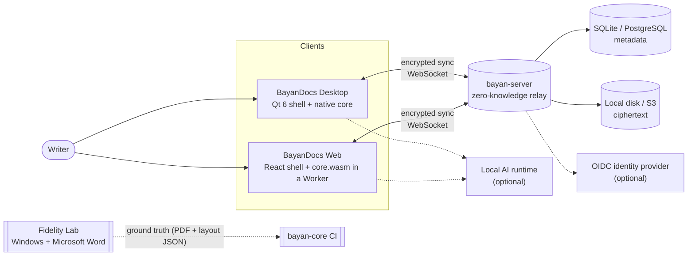
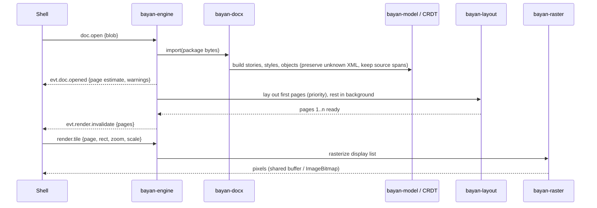
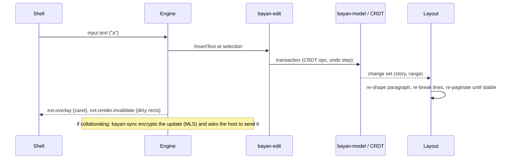
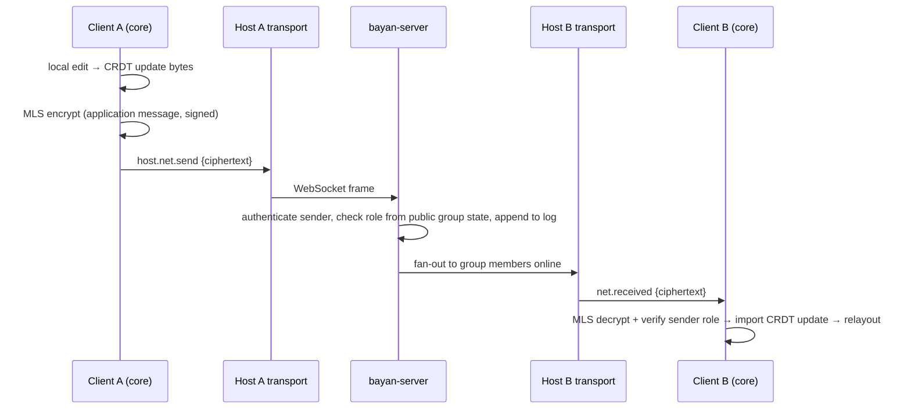

# 03 — Architecture

This document explains how BayanDocs is put together and why. The individual decisions, with alternatives and trade-offs, are in [adr/](../adr/README.md); the contracts between repositories are in [specs/](../specs/README.md).

## 1. The shape of the system in one paragraph

A single Rust engine, **bayan-core**, contains everything that understands documents: the document model, file import and export, text shaping, layout, rendering, PDF output, editing behavior, proofing, collaboration data structures and end-to-end encryption. It is compiled twice: as a native library linked into the **desktop** application (Qt 6) and as WebAssembly loaded by the **web** application (React) inside a Web Worker. Both applications are thin shells: they draw the interface, forward input to the engine, and display the pages the engine renders. The optional **server** never sees document content; it authenticates users, stores and relays encrypted data, and enforces who may write. A separate **Fidelity Lab** measures the engine against Microsoft Word.

## 2. System context

Key properties:

- The desktop application needs nothing else to work. The web application needs only a static file host to work with local files.
- The server is optional and only ever handles ciphertext plus the minimum metadata needed to route it (ADR-0015, ADR-0016).
- Microsoft Word is used only in the lab, as a measuring instrument. It is never a runtime dependency.

## 3. Repositories and their boundaries

| Repository | Owns | Must not contain |
|---|---|---|
| bayan-core | Every behavior that must be identical on desktop and web: model, formats, layout, rendering, editing commands, proofing, CRDT sync logic, MLS client, UI manifest (commands, ribbon, dialogs, strings), the Fidelity Lab tools, the CLI. | Windowing, platform UI, network sockets, platform file dialogs. |
| bayan-desktop | Windows, menus, the ribbon and dialogs rendered from the UI manifest, the document canvas widget, input methods, accessibility bridging to OS screen readers, printing, file associations, installers, auto-update. | Document logic of any kind. If two shells would need the same logic, it belongs in core. |
| bayan-web | The same responsibilities in the browser: React interface from the UI manifest, canvas compositor, input bridge, accessibility DOM mirror, PWA and storage glue. | Document logic of any kind. |
| bayan-server | Accounts, devices, sharing and roles, MLS delivery and authentication services, encrypted blob and log storage, WebSocket relay, admin, deployment artifacts (container, compose, Helm later). | Any code path that decrypts or interprets document content. |
| docs | Plans, ADRs, specs, work packages, handbooks. | Code other than examples. |

Contracts between repositories are versioned specs: the [engine protocol](../specs/engine-protocol.md) between core and shells, the sync protocol (written in Phase 1, SRV-104) between core and server, and the [document model](../specs/document-model.md) shared by every core crate. Shells and server pin exact core versions (ADR-0002).

## 4. Inside bayan-core

The core is a Cargo workspace of focused crates arranged in layers. A crate may depend only on crates in its own layer or below. Lower layers never know about higher ones, which keeps the engine testable and lets the server reuse the lower crates it needs (protocol, crypto, CRDT) without the layout engine.

```mermaid
flowchart TB
  subgraph L6["Bindings & tools"]
    ffi["bayan-ffi<br/>C ABI"]
    wasm["bayan-wasm<br/>wasm-bindgen + worker host"]
    cli["bayan-cli"]
    lab["lab/*<br/>fidelity tools"]
  end
  subgraph L5["Engine"]
    engine["bayan-engine<br/>protocol, session, scheduling, host services"]
  end
  subgraph L4["Interaction"]
    edit["bayan-edit"]
    a11y["bayan-a11y"]
    proof["bayan-proof"]
    sync["bayan-sync + bayan-mls"]
    script["bayan-script"]
    ai["bayan-ai"]
    ui["bayan-ui<br/>manifest, i18n"]
  end
  subgraph L3["Output"]
    render["bayan-render<br/>display list"]
    raster["bayan-raster"]
    pdf["bayan-pdf"]
  end
  subgraph L2["Layout"]
    layout["bayan-layout"]
    fields["bayan-fields"]
    drawing["bayan-drawing"]
    math["bayan-math"]
    charts["bayan-charts"]
  end
  subgraph L1["Text"]
    fonts["bayan-fonts"]
    text["bayan-text"]
  end
  subgraph L0["Model & formats"]
    model["bayan-model"]
    crdt["bayan-crdt"]
    styles["bayan-styles"]
    docx["bayan-docx"]
    rtf["bayan-rtf"]
    msdoc["bayan-msdoc"]
    odt["bayan-odt"]
  end
  subgraph LF["Foundation"]
    units["bayan-units"]
    opc["bayan-opc"]
    xml["bayan-xml"]
  end
  L6 --> L5 --> L4 --> L3 --> L2 --> L1 --> L0 --> LF
```

| Crate | Responsibility |
|---|---|
| bayan-units | Integer Bayan Layout Units (BLU = 1/25,400 pt), geometry, unit conversions, rounding modes, deterministic math (ADR-0005). |
| bayan-opc | Open Packaging Conventions: hardened ZIP reading and writing, content types, relationships, part names; OLE compound files for `.doc`, VBA projects, encrypted packages. |
| bayan-xml | Namespace-aware streaming XML, Markup Compatibility (`mc:AlternateContent`, `mc:Ignorable`) processing, lossless capture of unknown fragments, a writer with namespace management. |
| bayan-crdt | The only crate that talks to the CRDT library (Loro, ADR-0008). Exposes BayanDocs-shaped primitives so the library can be swapped. |
| bayan-model | The Bayan Document Model: stories of atoms, properties, tables, objects, notes, comments, fields, global parts, preserved content, invariants and normalization ([spec](../specs/document-model.md)). |
| bayan-styles | Style cascade: computes effective properties from document defaults, table styles, numbering, paragraph and character styles, and direct formatting, including toggle-property semantics. Incremental and cached. |
| bayan-docx, -rtf, -msdoc, -odt | Format importers and exporters. bayan-docx also implements verbatim pass-through of untouched content. |
| bayan-fonts | Font database (bundled, embedded, organization, system-provided bytes), matching and substitution, metrics, embedded-font de-obfuscation, subsetting. |
| bayan-text | Unicode segmentation, bidirectional algorithm, script itemization, shaping, hyphenation, justification, and the Word measurement model (how Word rounds and accumulates widths). |
| bayan-layout | Pages, sections, columns, paragraphs, lines, tables, floating objects and wrapping, footnotes, headers and footers, incremental re-layout. Output: a layout tree in BLU. |
| bayan-fields | Field-code parsing and evaluation, number and date picture switches, table of contents generation. |
| bayan-drawing | DrawingML and VML shapes (preset geometries, fills, lines, effects), images, EMF/WMF/EMF+, SVG. |
| bayan-math, bayan-charts | OMML equation layout (OpenType MATH); chart rendering from chart parts. |
| bayan-render | Turns the layout tree into a resolution-independent display list per page. |
| bayan-raster | The reference CPU rasterizer that turns display lists into pixels deterministically (ADR-0011). |
| bayan-pdf | PDF, PDF/A, PDF/UA and PDF/X output from display lists. |
| bayan-edit | Selection, caret movement (logical and visual for bidirectional text), commands, transactions, undo/redo, clipboard formats, find/replace, autocorrect, track-changes mode. |
| bayan-a11y | Accessibility tree generation and incremental updates. |
| bayan-proof | Spelling, grammar, hyphenation dictionaries (ADR-0022). |
| bayan-protocol | Message definitions and schemas of the client–server sync protocol, licensed Apache-2.0 so anyone can implement clients and integrations (ADR-0003); used by bayan-sync and by the server. |
| bayan-sync, bayan-mls | Sync protocol client, presence, offline queue; MLS group management and encryption of CRDT updates (ADR-0016). Shared with the server where applicable. |
| bayan-script | Sandboxed automation runtime and VBA tooling (ADR-0023). |
| bayan-ai | AI provider interface, prompts, chunking, mapping of suggestions back to document ranges (ADR-0024). |
| bayan-ui | The UI manifest (commands, ribbon, menus, shortcuts, KeyTips, declarative dialogs), Fluent string formatting, icon set (ADR-0019, ADR-0021). |
| bayan-engine | The facade every shell talks to: message protocol, session management, background scheduling, host-service requests, record/replay ([spec](../specs/engine-protocol.md)). |
| bayan-ffi, bayan-wasm | Thin bindings of the engine for C/C++ and for JavaScript in a Web Worker. |
| bayan-cli | Headless conversion, rendering, inspection; the backbone of the Fidelity Lab and of debugging. |

Not every crate exists from day one. Phase 0 creates units, opc, xml, crdt (spike), a text/raster spike, the engine skeleton, ffi, wasm and cli; the rest arrive in the phases listed in [05-work-breakdown.md](05-work-breakdown.md).

## 5. The document model in brief

The Bayan Document Model (BDM) is deliberately shaped like Word's own internal model, which is a stream of characters where paragraph marks, field delimiters and object anchors are themselves characters that carry properties. Concretely:

- A document is a set of **stories** (main body, each header and footer, each footnote, endnote, comment, text box and table cell) plus global parts (styles, numbering, settings, theme, fonts, media, custom XML, preserved parts).
- A story is a sequence of **atoms**: text characters and special atoms such as paragraph end, tab, break, field begin/separator/end, object anchor, note reference and range markers.
- Character formatting is a set of independent **marks** over ranges of atoms; paragraph properties belong to the paragraph-end atom, exactly as Word stores them on the paragraph mark.
- Tables are **objects** with rows and cells, and each cell holds its own story. Nested tables recurse naturally.
- Everything BayanDocs does not understand is **preserved** as anchored opaque XML so it can be written back unchanged.

This shape is what makes collaboration behave well: splitting a paragraph is inserting one atom, merging is deleting one, and two people formatting different properties of the same text both win. The full specification, including invariants and the deterministic normalization that repairs structure after concurrent edits, is [specs/document-model.md](../specs/document-model.md).

## 6. Key flows

### 6.1 Opening a `.docx`

### 6.2 Typing a character

Incremental layout is a first-class design requirement: an edit re-shapes only the affected paragraph, and re-pagination stops as soon as page boundaries line up with the previous layout again.

### 6.3 Saving

The exporter walks the model. Parts that were not touched are copied byte-for-byte from the original package. Within changed parts, untouched paragraphs and tables are emitted verbatim from their recorded source spans; changed elements are regenerated from the model with their preserved unknown children re-attached. The write is atomic (temporary file, flush, rename).

### 6.4 Collaborating

When a client is offline, its updates queue locally (encrypted at rest). On reconnect, clients exchange what each has seen and send only what is missing. CRDT updates commute, so arrival order does not matter.

## 7. Threading and runtime model

- **Desktop:** Qt's main thread runs the interface. The engine runs on its own thread (an actor that processes messages in order) plus a small worker pool for parallel shaping and rasterization. Engine events are delivered to Qt through queued signals. Tile pixels are written into buffers that Qt uploads as textures.
- **Web:** the React interface and an input bridge run on the main thread. The engine runs in a dedicated Web Worker. Messages cross with `postMessage`; rendered tiles cross as transferable `ImageBitmap`s and are composited on the main thread so scrolling stays smooth even while the engine is busy. Multi-threaded WebAssembly (which requires cross-origin isolation) is an optimization added once the single-threaded path is solid.
- **Server:** an async Rust runtime (tokio) with one task per connection; no shared mutable state outside the database and an in-process fan-out registry (a pub/sub backend in scale-out mode).

## 8. The engine boundary

Shells talk to the engine through a small, versioned **message protocol** (commands, queries and input in; events out; JSON-encoded) plus a few binary channels for file bytes, fonts, clipboard payloads and pixels. The same messages flow over a C ABI on desktop and `postMessage` on the web, so the two shells are programmed against one contract. Every inbound message can be recorded and replayed on another platform, which turns "it only happens on my machine" bugs into reproducible test cases. See [specs/engine-protocol.md](../specs/engine-protocol.md) and ADR-0012.

The engine never opens sockets, reads arbitrary files, or calls platform APIs itself. Anything that touches the outside world (fonts installed on the system, clipboard, network transport, AI inference, timers, opening a URL) is a **host service** request that the shell fulfils or refuses. This keeps the core portable, sandboxable and auditable.

## 9. Rendering and the determinism chain

Determinism is a chain, and every link is owned by the core:

1. **Fonts:** bundled, embedded or organization-provided font files, identified by content hash. System fonts are used only when nothing else provides the requested family, and the document is then flagged as machine-dependent.
2. **Shaping:** our pinned shaping engine, never the operating system's.
3. **Measurement and layout:** integer BLU arithmetic and the Word measurement model.
4. **Display list:** resolution-independent drawing commands per page.
5. **Rasterization:** our reference CPU rasterizer with grayscale anti-aliasing, never platform text rendering. Optional GPU backends may follow; they share geometry but are not the pixel reference.

Overlays that animate or change often (caret, selection highlight, remote cursors) are described by the engine as geometry and drawn by the shell on top of the page tiles, so blinking a caret never re-rasterizes a page.

## 10. Persistence

| Situation | What is stored | Where |
|---|---|---|
| Local file, single user | The `.docx` (on explicit save); an auto-recovery journal of CRDT updates every ~2 s; optionally local version history | File system; application data directory (desktop) or Origin Private File System (web) |
| Collaborative document | Encrypted CRDT update log, encrypted periodic snapshots produced by clients, encrypted media, encrypted original package | Server (database + blob store); encrypted local cache on each device |
| Settings and customizations | Ribbon customization, dictionaries, recent files | Local; optionally synced as an E2EE settings document |

Optionally (Phase 5), the CRDT history can be embedded inside a `.docx` as a BayanDocs custom part so two people exchanging files by email can merge their edits.

## 11. Extensibility

- **Automation API** (JavaScript/TypeScript) executed in a sandbox with capability prompts (ADR-0023).
- **Extensions** packaged as WebAssembly components, so one extension runs unchanged on desktop and web.
- **Host-service providers:** fonts, AI inference, storage and transport are interfaces a deployment can supply.
- **Organization services** on the server: font library, templates, dictionaries, AI endpoint configuration, policies.

## 12. Cross-cutting rules

- **Errors:** no panics cross the FFI or WebAssembly boundary (each entry point catches and converts them to error messages). Import never fails on unknown content; it preserves it and reports a warning.
- **Logging:** structured, leveled, and never containing document content, file names or user identifiers.
- **Privacy:** no telemetry; crash reports only with consent and without content.
- **Limits:** every parser and layout pass has explicit resource limits and is cancellable.
- **Configuration:** the engine receives all configuration from the host at startup; it reads no environment variables.
- **Feature flags:** compile-time features for optional subsystems (AI, scripting) and runtime flags controlled by the host, never by the document.

## 13. What is deliberately not decided yet

These are recorded so nobody decides them by accident. Each has an owner phase.

| Topic | Decide in | Notes |
|---|---|---|
| GPU rendering backend (e.g. Vello on wgpu) | Phase 4 | Only if CPU rasterization misses budgets on high-resolution displays. |
| Multi-threaded WebAssembly in the browser | Phase 2 | Requires cross-origin isolation headers on every deployment. |
| Exact local AI model | Phase 5 | The landscape changes monthly; choose by evaluation at the time. |
| Federation between servers | Phase 6+ | Identifiers are designed to be globally unique to keep the door open. |
| Layout-epoch pinning for regulated workflows | Phase 4 | Keeping old layout behaviors alive is costly; evaluate demand first. |
| Tablet and mobile shells | Phase 6 | Qt Quick keeps this possible. |
