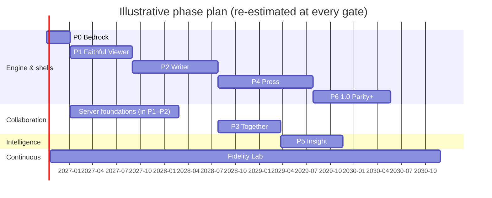

# 04 — Roadmap

BayanDocs is built in seven phases. Each phase ends with something real that can be used or measured, and with a **gate review**: a planning session that checks the exit criteria against evidence, updates the risks and decisions, and turns the next phase's draft work packages into ready ones. This is rolling-wave planning: the next phase is planned in detail, later phases only at the level of goals and epics, because what we learn in each phase changes the plan for the next.

## Phase overview

| Phase | Name | What you can do at the end | Public release |
|---|---|---|---|
| 0 | **Bedrock** (Foundations) | Nothing user-facing yet. The riskiest technical bets are proven or replaced, every repository has working gated CI, and the Fidelity Lab produces its first numbers. | — |
| 1 | **Faithful Viewer** | Open common `.docx` files on desktop or in a browser and see them laid out like Word; print and export PDF; re-save without changing anything. | Public alpha "BayanDocs Viewer" |
| 2 | **Writer** | Use BayanDocs as a daily single-user word processor for typical business and academic documents, offline, on desktop and web. | Public beta |
| 3 | **Together** | Self-host a server with one container and co-author with end-to-end encryption, offline merge, sharing and version history. | Collaboration beta → GA after external audit |
| 4 | **Press** | Professional, legal and academic workflows: equations, charts, citations, indexes, compare, mail merge, forms, `.doc`/`.odt`, PDF/X with CMYK, PDF/A, PDF/UA. | Feature releases |
| 5 | **Insight** | Local AI writing assistance, dictation and read-aloud, JavaScript automation, extensions, VBA inspection and assisted translation. | Feature releases |
| 6 | **1.0 Parity+** | Fidelity at 1.0 targets, the long tail of Word features, accessibility certification, full security audit, broad localization, tablet editing. | 1.0 |

## Timeline, honestly

This is a multi-year effort. LibreOffice, OnlyOffice and Google Docs each took a decade or more with large teams, and matching Word's layout is empirical research as much as engineering. AI agents change how fast code gets written, not how fast Word's undocumented behavior can be discovered and verified. A realistic expectation, assuming steady agent throughput and regular owner review, is a useful viewer within the first year, a usable editor in the second, and 1.0 in roughly three to five years. The chart below is illustrative only; gate reviews replace it with evidence.

Server work runs in parallel with the viewer and editor, because a zero-knowledge server does not depend on the layout engine at all.

## Phase 0 — Bedrock

**Goal:** prove or replace the riskiest bets before anything is built on them, and establish the machinery (CI gates, supply-chain enforcement, the Fidelity Lab) that keeps every later phase honest.

**Key work** ([phase-0 work packages](../workpackages/README.md#phase-0--bedrock)): repository baselines and security hardening; supply-chain enforcement; core workspace and units; spikes for the deterministic text pipeline, the CRDT document model, the Qt canvas, the browser worker canvas and MLS; hardened package and XML layers; engine protocol skeleton with C ABI and WebAssembly bindings; font audit; the Fidelity Lab corpus, Word harness, metrics and first measurement study; server scaffold; threat model.

**Exit criteria**

| ID | Criterion |
|---|---|
| E0.1 | All Phase-0 work packages are done or explicitly re-scoped; every ADR with a validation gate is confirmed or amended. |
| E0.2 | The text-pipeline spike lays out and rasterizes the probe set with identical layout hashes and identical pixel hashes on Linux x86-64, Windows x86-64, macOS arm64 and wasm32 (Node and one browser). |
| E0.3 | The CRDT spike converges with a valid normalized structure in 100% of 1,000 randomized three-replica runs of 10,000 operations each, and loads a 500-page synthetic document in WebAssembly within the budget recorded in its report. |
| E0.4 | The desktop and web spikes display engine-rendered pages, scroll and zoom smoothly, and route keyboard and IME input to the engine. |
| E0.5 | The Fidelity Lab holds at least 300 public-corpus documents with Word ground truth, and the metrics pipeline runs in CI. |
| E0.6 | The MLS spike encrypts and decrypts CRDT updates natively and in WebAssembly; the ciphersuite plan is recorded in ADR-0016. |
| E0.7 | Supply-chain gates (minimum age, audit, license allowlist, lockfile integrity) are active and green in every repository. |
| E0.8 | Phase-1 work packages are refined and marked Ready. |

## Phase 1 — Faithful Viewer

**Goal:** fidelity is the foundation, so it comes first. An editor built on an inaccurate layout engine is wasted work. A faithful viewer is also immediately useful: a fast, private, offline `.docx` viewer for desktop and web.

**Scope:** import of the core `.docx` feature set (text, styles, numbering, fonts, sections, headers and footers, footnotes, tables, images, shapes and text boxes, fields with cached results, comments and tracked changes displayed, bidirectional and complex scripts); the layout engine; rendering; PDF export; printing; lossless re-save; the viewer applications; signed builds; the server's identity, storage and relay foundations in parallel.

**Exit criteria** (fidelity numbers are initial targets, recalibrated at the Phase-0 gate once a baseline exists)

| ID | Criterion |
|---|---|
| E1.1 | On the public core corpus with bundled fonts: page count matches Word for ≥ 90% of documents, page-break agreement ≥ 85%, line-break agreement ≥ 95%, median glyph error ≤ 0.5 pt on agreeing lines. |
| E1.2 | Round-trip: 100% of public-corpus documents open, save and re-open with no content difference; untouched parts are byte-identical; Word opens every re-saved document without a repair prompt. |
| E1.3 | The determinism gate is green on the full public corpus. |
| E1.4 | PERF-02, PERF-03 (viewing) and PERF-06 budgets are met. |
| E1.5 | Every parser has been fuzzed continuously with no open crash findings; the malicious-sample suite confirms external content is blocked. |
| E1.6 | Screen readers (NVDA, VoiceOver, Orca) can read documents and navigate headings, lists and tables on desktop and web. |
| E1.7 | Signed desktop builds for Windows, macOS and Linux; the web viewer deploys as a static site and as a container. |

## Phase 2 — Writer

**Goal:** a single-user editor good enough to be a daily driver for typical documents.

**Scope:** text input with IME; selection and caret behavior matching Word; formatting, styles, lists, tables, images, headers and footers, footnotes, track changes and comments; clipboard interop (OOXML, HTML, RTF, plain text); find and replace; undo/redo; saving with minimal XML changes; spelling, grammar (English) and hyphenation; Classic ribbon and Focus mode from the shared UI manifest; autosave and recovery; templates; password-encrypted files; accessible editing; PDF/A and tagged PDF.

**Exit criteria (summary):** every Phase-2 row of the requirements and coverage matrix is met; "edit fidelity" passes in the lab (the same scripted edits applied in Word and in BayanDocs produce matching layouts); keystroke latency and memory budgets are met; screen-reader editing works; the project's own documentation is written in BayanDocs (dogfooding).

## Phase 3 — Together

**Goal:** the collaboration and sovereignty promise.

**Scope:** server accounts with OIDC and passkeys; devices and cross-signing; MLS groups per document; encrypted sync relay; presence; sharing, roles and E2EE link sharing; offline merge; version history; real-time comments and suggestions; admin console and CLI; backups; one-container deployment, compose and documentation; external security audit.

**Exit criteria (summary):** desktop and web clients converge under randomized multi-client tests including partitions; an external audit of the cryptographic design and server finds no open high-severity issues; the scale targets in PERF-07 are met; backup and restore are proven; self-hosting documentation lets a non-expert deploy in under 30 minutes.

## Phase 4 — Press

**Goal:** professional publishing and the heavy features that legal, academic and enterprise users depend on.

**Scope:** equation editing; chart editing with embedded data; citations and bibliography; indexes and tables of authorities; compare and combine; mail merge; content controls and forms; protection and signatures; ribbon customization; `.doc` import; `.odt` import/export; HTML export; PDF/X-4 and X-1a with ICC-based CMYK, bleed, slug and marks; validated PDF/A and PDF/UA; accessibility checker; outline view; tablet support; SCIM and compliance escrow for enterprises; scale-out server mode.

## Phase 5 — Insight

**Goal:** intelligence and extensibility, all local-first.

**Scope:** local AI provider and model management; grammar, style and context suggestions; dictation and read-aloud; JavaScript automation API; WebAssembly extensions; VBA viewer and assisted translation; EPUB export; enhanced typography for native documents; history embedded in `.docx` for file-based merging.

## Phase 6 — 1.0 Parity+

**Goal:** close the remaining gaps and harden.

**Scope:** fidelity at 1.0 targets across all corpus tiers; long-tail Word features (WordArt effects, 3D charts, ink, linked text boxes, vertical layout edge cases); VBA compatibility runtime for a documented subset; accessibility certification (VPAT); localization into the most-requested languages; performance hardening; full external security audit; tablet editing; long-term support policy.

## Gate review procedure

At the end of each phase, run a planning session using the prompt in [06-agent-workflow.md](06-agent-workflow.md#phase-gate-planning-session). It must:

1. Collect evidence for each exit criterion (CI results, lab reports, audit reports) and record pass/fail in `plan/gates/phase-N.md`.
2. Review every ADR with a validation gate or a "revisit when" trigger that fired.
3. Update the risk register.
4. Recalibrate fidelity and performance targets for the next phase from measured baselines.
5. Split the next phase's draft work packages into Ready briefs, ordered into waves.
6. Re-estimate the timeline from actual throughput.
