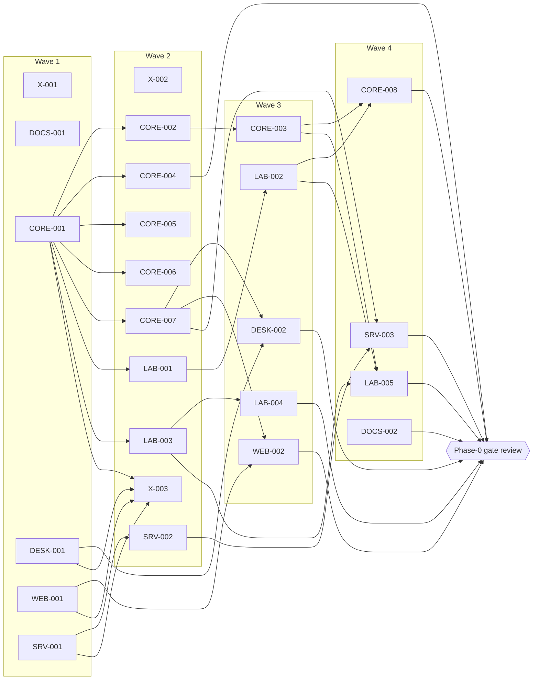

# 05 — Work Breakdown

The work is organized into **streams** (long-lived areas of responsibility), **epics** (a phase's worth of work in one stream) and **work packages** (WPs: self-contained briefs an agent can complete in one to several sessions). Phase 0 is broken down to Ready work packages. Phase 1 is broken down to draft work packages that the Phase-0 gate review will refine. Later phases are listed as epics.

## Streams

| Stream | Scope | Main repo |
|---|---|---|
| MODEL | Document model, CRDT adapter, styles, numbering, fields | bayan-core |
| FORMATS | DOCX, RTF, DOC, ODT, HTML, Markdown import/export; packaging; preservation | bayan-core |
| TEXT | Fonts, shaping, Unicode, line breaking, hyphenation, Word measurement model | bayan-core |
| LAYOUT | Paragraphs, pagination, tables, floats, notes, sections, headers/footers, math, charts | bayan-core |
| OUTPUT | Display lists, rasterization, PDF family, printing | bayan-core (+ desktop for print) |
| EDIT | Selection, commands, transactions, undo, clipboard, find, autocorrect, track changes | bayan-core |
| LAB | Fidelity Lab: corpora, Word ground truth, metrics, Word Behavior Notes, determinism matrix | bayan-core (`lab/`) |
| UI | Shared UI manifest, strings, icons; desktop and web interfaces | core + desktop + web |
| DESKTOP | Qt shell, canvas, input, accessibility bridge, packaging | bayan-desktop |
| WEB | React shell, worker engine host, compositor, input bridge, accessibility mirror, PWA | bayan-web |
| SYNC | Sync protocol, presence, offline queue (client side) | bayan-core |
| SERVER | Accounts, devices, groups, relay, storage, admin, deployment | bayan-server |
| CRYPTO | MLS, identity and device keys, recovery, link sharing | core + server |
| SECURITY | Threat models, fuzzing, hardening, audits, supply chain | all |
| A11Y-I18N | Accessibility and internationalization across all layers | all |
| AUTOMATION-AI | Scripting, extensions, VBA tools, local AI | bayan-core (+ shells) |
| DOCS | Knowledge base, handbooks, contributor guides | docs |
| RELEASE | Versioning, signing, SBOM, provenance, distribution, updates | all |

## Sizing

| Size | Meaning |
|---|---|
| S | About one focused agent session; one pull request. |
| M | Two to four sessions; one or two pull requests. |
| L | Five or more sessions or several pull requests; usually a spike or a subsystem. |

## Phase 0 — Bedrock: Ready work packages

Briefs are in [workpackages/phase-0/](../workpackages/phase-0/). Waves show what can run in parallel; a WP may start as soon as its dependencies are merged.

| ID | Title | Repo | Size | Depends on | Wave |
|---|---|---|---|---|---|
| [X-001](../workpackages/phase-0/X-001-repository-baseline.md) | Repository baseline: governance files, PR template, DCO, licenses, REUSE | all | M | Owner confirms ADR-0003 (license part only) | 1 |
| [DOCS-001](../workpackages/phase-0/DOCS-001-knowledge-base-site.md) | Knowledge-base site (mdBook) and docs CI | docs | S | — | 1 |
| [CORE-001](../workpackages/phase-0/CORE-001-workspace-and-gate.md) | Core workspace scaffold and verification gate | core | M | — | 1 |
| [DESK-001](../workpackages/phase-0/DESK-001-desktop-scaffold.md) | Desktop scaffold and CI | desktop | M | — (stub engine until CORE-007) | 1 |
| [WEB-001](../workpackages/phase-0/WEB-001-web-scaffold.md) | Web scaffold and CI | web | M | — | 1 |
| [SRV-001](../workpackages/phase-0/SRV-001-server-scaffold.md) | Server scaffold, container and CI | server | M | — | 1 |
| [X-002](../workpackages/phase-0/X-002-ci-security-baseline.md) | CI security baseline: hardened workflows, workflow linting, Scorecard | all | S | Each repo's scaffold | 2 |
| [X-003](../workpackages/phase-0/X-003-supply-chain-enforcement.md) | Supply-chain enforcement and the monthly update runbook | all code repos | M | CORE-001, SRV-001, WEB-001, DESK-001 | 2 |
| [CORE-002](../workpackages/phase-0/CORE-002-bayan-units.md) | `bayan-units`: integer layout units and deterministic math | core | S | CORE-001 | 2 |
| [CORE-004](../workpackages/phase-0/CORE-004-spike-crdt-document-model.md) | Spike: Word-shaped document model on Loro | core | L | CORE-001 | 2 |
| [CORE-005](../workpackages/phase-0/CORE-005-bayan-opc.md) | `bayan-opc`: hardened package layer | core | M | CORE-001 | 2 |
| [CORE-006](../workpackages/phase-0/CORE-006-bayan-xml.md) | `bayan-xml`: Markup-Compatibility-aware XML with lossless preservation | core | M | CORE-001 | 2 |
| [CORE-007](../workpackages/phase-0/CORE-007-engine-skeleton.md) | Engine skeleton: protocol v0, C ABI, WebAssembly worker host | core | L | CORE-001 | 2 |
| [LAB-001](../workpackages/phase-0/LAB-001-corpus-infrastructure.md) | Corpus infrastructure and public corpus v1 | core | M | CORE-001 | 2 |
| [LAB-003](../workpackages/phase-0/LAB-003-layout-json-and-pdf-extraction.md) | Layout JSON schema and PDF glyph extraction | core | M | CORE-001 | 2 |
| [SRV-002](../workpackages/phase-0/SRV-002-spike-mls.md) | Spike: MLS encryption of CRDT updates, native and WebAssembly | server | L | SRV-001 | 2 |
| [CORE-003](../workpackages/phase-0/CORE-003-spike-deterministic-text.md) | Spike: deterministic text pipeline across platforms | core | L | CORE-002 | 3 |
| [LAB-002](../workpackages/phase-0/LAB-002-word-ground-truth-harness.md) | Word ground-truth harness on the reference machine | core | M | LAB-001; owner provides reference machine | 3 |
| [LAB-004](../workpackages/phase-0/LAB-004-metrics-and-report.md) | Comparison metrics and fidelity report | core | M | LAB-003 | 3 |
| [DESK-002](../workpackages/phase-0/DESK-002-spike-qt-canvas.md) | Spike: Qt Quick document canvas, input and accessibility | desktop | L | DESK-001, CORE-007 | 3 |
| [WEB-002](../workpackages/phase-0/WEB-002-spike-worker-canvas.md) | Spike: worker canvas, input bridge and accessibility mirror | web | L | WEB-001, CORE-007 | 3 |
| [CORE-008](../workpackages/phase-0/CORE-008-font-audit.md) | Font audit and bundled-library proposal | core + docs | M | CORE-003; LAB-002 for Microsoft font metrics | 4 |
| [LAB-005](../workpackages/phase-0/LAB-005-probes-and-first-study.md) | Probe generator and first Word measurement study | core + docs | L | LAB-002, LAB-003, CORE-003 | 4 |
| [SRV-003](../workpackages/phase-0/SRV-003-threat-model.md) | Threat model v1: server, sync and encryption | docs | M | SRV-002, CORE-007 | 4 |
| [DOCS-002](../workpackages/phase-0/DOCS-002-contributor-onboarding.md) | Contributor onboarding and development-environment guides | docs | S | All Wave-1 scaffolds | 4 |

**Suggested pace:** run three to five work packages at a time, so that you can review every pull request properly. Wave 1 alone is six independent packages; start with CORE-001, SRV-001 and WEB-001 if you want the fewest moving parts.

**Owner-dependent items:** X-001's license files need your confirmation of ADR-0003; LAB-002 (and therefore LAB-005 and part of CORE-008) needs the Word reference machine described in [09-owner-checklist.md](09-owner-checklist.md).

## Phase 1 — Faithful Viewer: draft work packages

Drafts are in [workpackages/phase-1/](../workpackages/phase-1/). They are scoped and ordered but will be refined into Ready briefs at the Phase-0 gate, because the spikes may change them.

| Stream | Draft WPs | File |
|---|---|---|
| MODEL, FORMATS, TEXT, LAYOUT, OUTPUT | CORE-101 … CORE-130: model v1; DOCX import (body; styles, theme, settings, fonts; numbering; tables, sections, headers/footers, notes, comments; drawings); lossless export; style cascade; numbering engine; font system; text pipeline; line breaking, justification, tabs and bidi; paragraph layout and pagination; headers, footers and page numbers; tables; floats and wrapping; notes; columns and sections; fields; comment and revision display; display list and rasterizer; images and DrawingML; EMF/WMF/EMF+; PDF export; viewing API; equations; charts and SmartArt; accessibility tree; performance; active-content blocking | [core.md](../workpackages/phase-1/core.md) |
| LAB | LAB-101 … LAB-109: corpus growth and private corpus; Word studies (paragraphs, tables, floats, pagination); fidelity gate; determinism gate; Word re-open verification; public dashboard | [lab.md](../workpackages/phase-1/lab.md) |
| DESKTOP | DESK-101 … DESK-104: viewer application; printing path; accessibility bridge; packaging, signing and updates | [desktop.md](../workpackages/phase-1/desktop.md) |
| WEB | WEB-101 … WEB-103: viewer application; accessibility mirror; PWA, offline and deployment | [web.md](../workpackages/phase-1/web.md) |
| SERVER, CRYPTO | SRV-101 … SRV-105: identity; storage; MLS delivery and WebSocket relay; sync protocol v1 and reference client; operations | [server.md](../workpackages/phase-1/server.md) |
| DOCS | DOCS-101 … DOCS-103: viewer guide and release notes; living architecture and API reference; Word Behavior Notes publication | [docs.md](../workpackages/phase-1/docs.md) |
| RELEASE | X-101, X-102: release engineering across repositories; nightly cross-repo integration | [cross-cutting.md](../workpackages/phase-1/cross-cutting.md) |

Critical path for Phase 1: CORE-101 → CORE-102/103/105 → CORE-108 → CORE-110/111/112 → CORE-113 → CORE-115/116 → CORE-121 → CORE-125 → DESK-101 / WEB-101, with LAB studies feeding CORE-111 through CORE-118 throughout.

## Phases 2–6: epics

Each epic becomes a set of work packages at the gate review before its phase.

### Phase 2 — Writer

| Epic | Stream | Summary |
|---|---|---|
| E2-EDIT-CORE | EDIT | Selection and caret model (including bidirectional and table selections), commands and transactions, undo/redo, typing and IME composition, delete and merge semantics measured against Word |
| E2-FORMAT | EDIT, MODEL | Character and paragraph formatting commands, styles with impact preview, lists, format painter, clear/reveal formatting |
| E2-TABLE-EDIT | EDIT | Insert, draw, structure editing, merge/split, autofit, sort, formulas, conversions |
| E2-OBJECTS | EDIT, LAYOUT | Insert, move, resize, wrap and anchor pictures, shapes, text boxes |
| E2-CLIPBOARD | FORMATS, EDIT | OOXML, HTML, RTF and plain-text clipboard both ways; paste options |
| E2-REVIEW | EDIT | Track-changes authoring, accept/reject, comments authoring and threads |
| E2-FIND | EDIT | Find and replace with formatting, special characters and Word wildcards |
| E2-SAVE | FORMATS, EDIT | Minimal-diff export of edited content, atomic saves, autosave and recovery journal |
| E2-PROOF | AUTOMATION-AI | Spelling, English grammar rules engine, hyphenation |
| E2-UI-MANIFEST | UI | Commands, ribbon, menus, KeyTips, shortcuts, declarative dialogs, Fluent strings, icons |
| E2-DESK-UI, E2-WEB-UI | DESKTOP, WEB | Classic ribbon, panes, dialogs and Focus mode in each shell |
| E2-A11Y-EDIT | A11Y-I18N | Screen-reader editing on desktop and web; keyboard-only operation |
| E2-I18N | A11Y-I18N | Localization pipeline, mirrored right-to-left interface, IME test matrix, kashida, kinsoku and character grid |
| E2-FORMATS | FORMATS | RTF, HTML paste, Markdown, plain text; password-encrypted files |
| E2-TEMPLATES | MODEL | `.dotx` support, default template and styles |
| E2-PDF | OUTPUT | PDF/A-2b and tagged PDF |
| E2-LAB | LAB | Edit-fidelity harness: the same scripted edits in Word and BayanDocs |
| E2-SRV | SERVER, CRYPTO | Server groundwork for Phase 3: groups, devices, relay hardening |

### Phase 3 — Together

E3-ACCOUNTS (OIDC, passkeys, sessions) · E3-DEVICES-KEYS (identity keys, cross-signing, recovery kit) · E3-GROUPS-SHARING (MLS group per document, roles, E2EE link sharing, revocation) · E3-SYNC (client and server sync, encrypted snapshots, compaction) · E3-PRESENCE · E3-OFFLINE (queues, encrypted local cache, partition tests) · E3-HISTORY (named versions, restore, compare) · E3-COMMENTS-RT · E3-ADMIN (console, CLI, policies, quotas) · E3-DEPLOY (container, compose, docs, backups) · E3-AUDIT (external cryptography and server audit) · E3-SCALE (load tests, PERF-07).

### Phase 4 — Press

E4-MATH-EDIT · E4-CHARTS-EDIT · E4-CITATIONS · E4-INDEX-TOA · E4-COMPARE · E4-MAILMERGE · E4-FORMS (content controls, legacy form fields, data binding) · E4-PROTECT-SIGN · E4-RIBBON-CUSTOM · E4-DOC-IMPORT · E4-ODT · E4-HTML-EXPORT · E4-PRINT (PDF/X, ICC CMYK, bleed, slug, marks) · E4-PDF-VALIDATED (PDF/A, PDF/UA in CI) · E4-A11Y-CHECKER · E4-OUTLINE-VIEW · E4-CJK-ADVANCED (vertical text, ruby, combined characters) · E4-TABLET · E4-ENTERPRISE (SCIM, compliance escrow) · E4-SCALEOUT · E4-VBA-VIEWER.

### Phase 5 — Insight

E5-AI-PROVIDER (runtime, model management, policy) · E5-AI-FEATURES (grammar, style, context suggestions) · E5-SPEECH (dictation, read aloud) · E5-AUTOMATION-API · E5-EXTENSIONS (WebAssembly components) · E5-VBA-TRANSLATE · E5-EPUB · E5-TYPO-PLUS (optimal line breaking and other opt-in typography) · E5-HISTORY-IN-DOCX (file-based merge).

### Phase 6 — 1.0 Parity+

E6-FIDELITY-1.0 · E6-LONG-TAIL · E6-VBA-RUNTIME · E6-A11Y-CERT · E6-L10N · E6-PERF · E6-AUDIT · E6-TABLET-EDIT · E6-LTS (long-term support and release policy).
