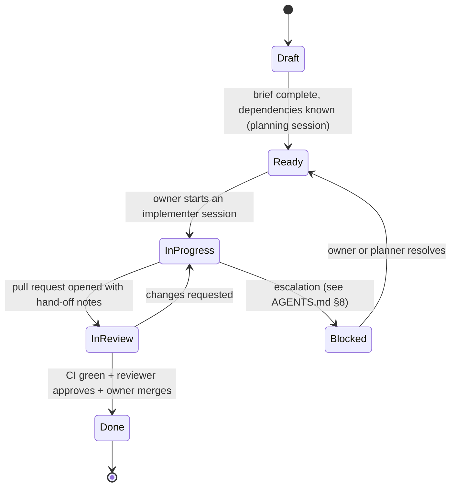

# 06 — Agent Workflow: How Work Gets Handed Off, Done and Reviewed

BayanDocs is built mostly by AI agents working in separate sessions, steered and reviewed by the owner. This document is the operating procedure that makes that safe: how a work package (WP) moves from idea to merged code, what every hand-off contains, and the ready-to-paste prompts for each kind of session.

## Roles

| Role | Who | Responsibilities |
|---|---|---|
| Owner | You | Sets direction, confirms decisions marked for confirmation, provides accounts and hardware, starts sessions, merges pull requests. You do not need to understand every line of code; you need to check that the process was followed and the evidence is present. |
| Planner | An agent in a planning session | Writes and refines ADRs, specs and WPs; runs phase-gate reviews. |
| Implementer | An agent in a WP session | Executes exactly one WP and opens a pull request with a complete hand-off. |
| Reviewer | An agent in a review session (never the same session as the implementer) | Checks a pull request against its WP, the ADRs and the rules, and explains the verdict to the owner in plain language. |

## Work package lifecycle



Status lives in the index table of [workpackages/README.md](../workpackages/README.md). The reviewer session updates it after a merge (a one-line pull request to this repository). If you prefer a board, each Ready WP can also be mirrored as a GitHub issue that links to its brief; the brief remains the source of truth.

## Definition of Ready (for a WP)

- Objective, scope (in and out), deliverables and testable acceptance criteria are written.
- Every dependency is Done, or the brief explains how to proceed without it.
- Linked ADRs are Accepted (or the WP is itself the spike that validates them).
- The repositories to attach to the session are listed.
- Anything only the owner can provide is available.

## Definition of Done (for a WP)

- Every acceptance criterion is met, with evidence in the pull request (test names, command output, screenshots, reports).
- The repository's verification gate passes locally and in CI.
- New behavior has tests; bug fixes have regression tests; layout-affecting changes include Fidelity Lab evidence.
- Dependency and security rules are followed; every new dependency is justified in the pull request.
- Documentation affected by the change is updated (in the same repository, or as a linked pull request to `docs`).
- The pull request contains the complete hand-off template below.
- A reviewer session has approved, and the owner has merged.

## How to hand off a work package (owner's procedure)

1. Pick a Ready WP whose dependencies are Done ([workpackages/README.md](../workpackages/README.md)).
2. Start a new agent session in the BayanDocs cloud environment (see [Cloud environment](#cloud-environment-for-agent-sessions)). Attach the repositories listed in the brief's header, always including `docs` so the agent can read the brief, the ADRs and the specs. One WP per session.
3. Use the strongest available model for spikes, layout and fidelity work, and anything touching cryptography or security. Faster models are fine for scaffolding and documentation WPs.
4. Paste the **work package prompt** below, replacing the placeholders.
5. When the agent opens a pull request, start a separate session with the **review prompt**.
6. Merge when CI is green and the reviewer approves. If the reviewer requests changes, paste the review into the implementer session (or start a new implementer session with the WP prompt plus "address the review at <link>").
7. If an agent reports that it is blocked, read its options and recommendation; decide, or start a planning session to decide.

## Cloud environment for agent sessions

Agent sessions run in a Claude Code cloud environment (Ubuntu 24.04). Its **setup script** is [scripts/cloud-environment-setup.sh](../scripts/cloud-environment-setup.sh): paste the whole file into the environment's settings (the cloud environment menu in a session's title bar → Edit → Setup script). It runs before each new session starts, and its result is cached for about seven days, so sessions start with the tools already installed.

- **What it installs:** Rust (the pinned stable toolchain with `clippy`, `rustfmt` and the `wasm32-unknown-unknown` target, plus a pinned nightly for fuzzing), `cargo-deny`, `cargo-fuzz`, mdBook, lychee, typos, REUSE, zizmor, pinact, Node.js LTS with pnpm through Corepack, Qt (LGPL modules only) with aqtinstall and the system headers it needs, and ShellCheck. Run `bayandocs-tools` in a session to see the installed versions; logs are in `/var/log/bayandocs-setup/`.
- **How it follows the dependency policy (ADR-0017):** every version is pinned exactly and was at least 24 hours old when pinned; every download is verified against a hash in the script (or by the tool's own signed metadata); Ubuntu packages come from the signed archive frozen at a snapshot date. Pins change only in the monthly dependency session, which also tests the script and asks you to paste the new version.
- **Network:** everything comes from the default **Trusted** list except Qt, which needs `download.qt.io` and `master.qt.io` (choose **Custom**, keep the default list, and add those two). If release downloads from GitHub are refused, the script builds those tools from their verified sources instead.
- **Failures never block a session:** a failed step is listed by `bayandocs-tools`, and the session starts anyway. An agent that finds a tool missing installs the same pinned version (never a newer one) and reports it.

## Ready-to-paste prompts

Each prompt is a single paragraph. Replace the parts in angle brackets.

### Work package session

```text
You are working on BayanDocs, an open-source, Word-compatible word processor whose plan lives in the BayanDocs/docs repository. Your task is work package <WP-ID>, whose brief is docs/workpackages/<path-to-brief>.md. Before writing any code, read docs/AGENTS.md, the AGENTS.md of every repository you will change, the work package brief, and every ADR and spec the brief links to. Work only within the brief's scope, follow the dependency, security and determinism rules exactly, run each repository's verification gate before every push, and open a pull request whose description follows the hand-off template in docs/plan/06-agent-workflow.md. If anything in the brief is ambiguous, conflicts with an Accepted ADR, or needs a decision the brief does not authorize, stop and explain the problem with your recommended options instead of guessing. Explain your work in plain language, because the owner is still learning these languages.
```

### Pull request review session

```text
You are reviewing a pull request for BayanDocs, an open-source, Word-compatible word processor whose plan lives in the BayanDocs/docs repository. The pull request is <PR-URL> and it implements work package <WP-ID> (brief: docs/workpackages/<path-to-brief>.md). Read docs/AGENTS.md, the target repository's AGENTS.md, the brief, and the ADRs and specs it links to, then review the pull request for: whether every acceptance criterion is met with real evidence; correctness and test quality; scope creep; compliance with the dependency policy (exact pins, packages at least 24 hours old, justified, allowed licenses, no update bots); security issues; determinism rules in the core; and whether the hand-off notes are complete and honest. Do not push changes. Produce a verdict (approve, or request changes with a numbered list of required fixes), then explain in plain language what the pull request does and anything the owner should understand before merging. If the review is an approval, also open a one-line pull request to the docs repository that marks the work package Done in docs/workpackages/README.md once the owner merges.
```

### Phase-gate planning session

```text
You are the planner for BayanDocs, an open-source, Word-compatible word processor whose plan lives in the BayanDocs/docs repository. Phase <N> is finishing. Read docs/AGENTS.md, everything in docs/plan, the ADR index, the specs, and the work package index, then follow the gate review procedure in docs/plan/04-roadmap.md: collect evidence for each exit criterion of Phase <N> from merged pull requests, CI results and Fidelity Lab reports and record pass or fail in docs/plan/gates/phase-<N>.md; review every ADR whose validation gate or revisit trigger fired and propose amendments as new ADRs; update the risk register; recalibrate the next phase's fidelity and performance targets from measured baselines; refine the next phase's draft work packages into Ready briefs using docs/workpackages/TEMPLATE.md, ordered into waves; and re-estimate the timeline from actual throughput. Ask me before accepting any decision that ADR-0001 says requires owner confirmation. Deliver everything as one pull request to the docs repository with a plain-language summary of what changed and why.
```

### Monthly dependency update session

```text
You are running the batched dependency update for the BayanDocs repository <repo>, following ADR-0017 and the dependency rules in docs/AGENTS.md. Update every dependency (packages, toolchains, pinned CI actions and tool versions) to the newest version that has been published for at least 24 hours, skipping any version younger than that and noting it for next month. Keep exact pins and the committed lockfile, keep install scripts disabled, and never add Dependabot version updates, Renovate or any other update bot. Run the repository's full verification gate, fix whatever breaks, and land one green pull request whose description lists every change (old version, new version, publish date, notable changelog items, and anything that broke and how you fixed it). If the repository's dependency posture changed, update its ADR or posture document in the same pull request. If <repo> is docs, also update the pins in scripts/cloud-environment-setup.sh by the same rules (release binaries with their SHA-256 hashes, Python tools with hashes regenerated by scripts/python-tool-hashes.py, the Ubuntu snapshot date, and toolchains matching the code repositories' pins), run the script in the session to prove it works, and tell me to paste the new version into the cloud environment's setup script.
```

### Security alert response session

```text
A Dependabot security alert fired for <package> in the BayanDocs repository <repo> (<alert-URL>). Following ADR-0017 and docs/AGENTS.md, assess whether BayanDocs is actually affected (which code paths use the vulnerable functionality) and update the dependency to the lowest fixed version that has been published for at least 24 hours, together with anything else that must move with it. If the only fixed version is younger than 24 hours, do not install it; instead apply the safest available mitigation (for example disabling the affected feature or pinning an unaffected version), explain the exposure to me, and state when the fix becomes eligible. Run the full verification gate and land one green pull request explaining the vulnerability, our exposure, and the change, in plain language.
```

### Architecture review session (every 10–15 merged WPs)

```text
You are performing an architecture review of BayanDocs. Read docs/AGENTS.md, docs/plan/03-architecture.md, the ADR index and the specs, then review the current main branches of bayan-core, bayan-desktop, bayan-web and bayan-server for drift from the Accepted ADRs and specs: logic that belongs in the core but was written in a shell, crate layering violations, determinism hazards, unjustified dependencies, security weaknesses, missing tests, and duplicated work. Do not change code. Produce a report in docs/plan/reviews/<date>.md with findings ranked by severity, each with a concrete recommended fix sized as S, M or L, and open it as a pull request to the docs repository with a plain-language summary for the owner.
```

## Hand-off template

Every implementer pull request description uses this structure. Reviewers reject pull requests that omit sections.

```markdown
## Summary
What changed and why, in plain language (3–8 sentences).

## Work package
<WP-ID> — link to the brief.

## Acceptance criteria
- [x] AC-1 … — evidence: test name / command output / screenshot / report link
- [ ] AC-n … — not met because … (only with an explanation and a follow-up)

## Verification
Commands run and their results (summarized), CI link.

## Dependencies added or changed
For each: name, exact version, publish date (≥ 24 h old), license, purpose, alternatives considered, transitive dependencies added. Or "None".

## Deviations from the brief
Anything done differently from the brief, and why. Or "None".

## Follow-ups
Discovered work that is out of scope, with suggested size. Or "None".

## Open questions for the owner
Or "None".

## Notes for the next agent
Where things are, what is fragile, what to read first.

## Developer Certificate of Origin
(Once the DCO check is enabled. Agents leave this for the human submitter, who adds their own line before merging.)
Signed-off-by: <human submitter's name and email>
```

## Escalation

Agents stop and hand back instead of guessing in the situations listed in [AGENTS.md §8](../AGENTS.md#8-when-to-stop-and-ask). A good escalation states the problem in one sentence, lists two or three options with consequences, and recommends one. When you receive one, you can answer directly, or start a planning session with the escalation pasted in.

## Session hygiene

- One WP per implementer session; a fresh session for each review.
- Attach only the repositories the brief lists, plus `docs`.
- Agents never merge their own pull requests and never approve their own work.
- Long WPs (size L) may span several sessions; each session ends with a pushed branch and hand-off notes in the draft pull request so the next session can resume.
- When an agent produces text for you to copy, it uses flowing paragraphs without hard line breaks.

## Your review checklist (non-expert friendly)

1. Is CI green on the latest commit?
2. Did a separate reviewer session approve, and do you understand its plain-language explanation?
3. Does the pull request list evidence for every acceptance criterion?
4. Did it add or change dependencies? If so, is each one justified, and is each version at least 24 hours old?
5. Does it change files outside the brief's scope? If so, is there a good reason in "Deviations"?
6. Are there open questions for you? Answer them before merging.
7. Once the DCO check is enabled (X-001), add your own `Signed-off-by: Your Name <email>` line to the pull request description and keep it in the squash-merge commit message. This is your certification, as the person submitting the work, that the project may use the contribution under its license; agents cannot make it for you (ADR-0003).
