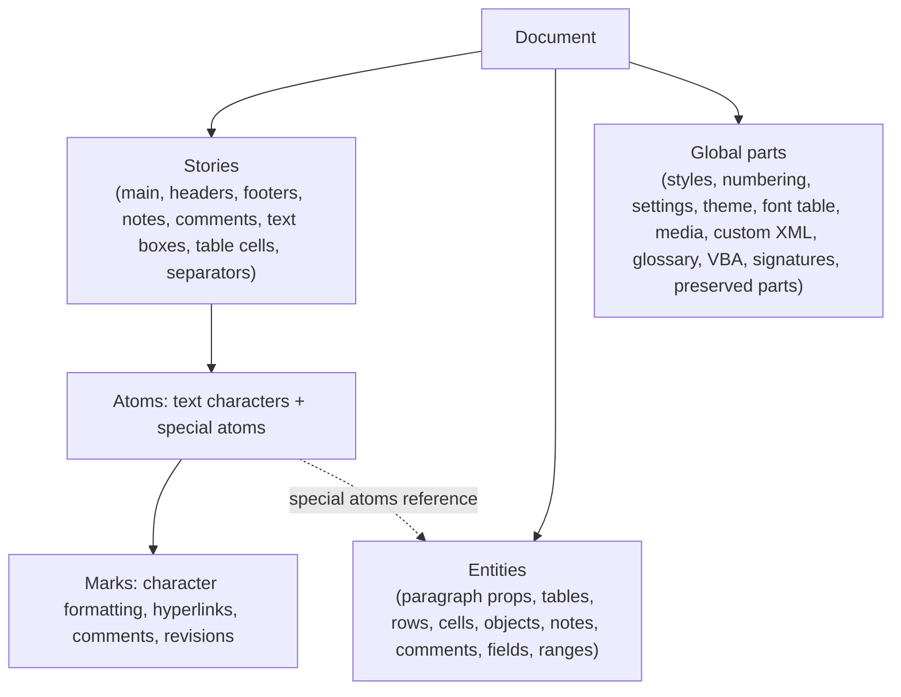

# Bayan Document Model (BDM) — v0

- **Status:** Draft v0. Binding in its principles (ADR-0007); details are validated and finalized by CORE-004, then promoted to v1 by CORE-101.
- **Owner stream:** MODEL
- **Related:** ADR-0005, ADR-0007, ADR-0008, ADR-0018, [coverage-matrix.md](coverage-matrix.md)

## 1. Purpose and design goals

The BDM is the in-memory representation of a document inside bayan-core. It must:

1. **Represent all of WordprocessingML losslessly**, including content BayanDocs does not understand (Tier B).
2. **Make Word's editing semantics natural**, by mirroring Word's own internal model: a stream of characters in which structural marks are characters.
3. **Merge concurrent edits sensibly** when stored in a CRDT (ADR-0008).
4. **Support fast incremental layout** through stable identities and precise change notifications.
5. **Be deterministic:** the same operations produce the same model on every platform.

## 2. Overview

## 3. Stories

A **story** is an independent flow of content. Every story is a sequence of atoms (§4) that ends with a paragraph end.

| Story kind | Source in OOXML | Notes |
|---|---|---|
| Main | `w:body` | Exactly one per document. |
| Header / Footer | `word/header*.xml`, `word/footer*.xml` | Referenced from section properties (default, first, even). |
| Footnote / Endnote | `word/footnotes.xml`, `word/endnotes.xml` | One story per note. |
| Note separators | special notes with `w:type="separator"`, `continuationSeparator`, `continuationNotice` | One of each kind per note type. |
| Comment | `word/comments.xml` | One story per comment. |
| Text box | `w:txbxContent` inside DrawingML or VML | Linked text boxes share one story across several objects. |
| Table cell | `w:tc` | One story per cell (§7). |
| Glossary | `word/glossary/document.xml` | A nested BDM document for building blocks. |

Every story has a stable `StoryId`.

## 4. Atoms

An **atom** is one position in a story: a Unicode text character, or a special atom. Special atoms are stored as **placeholder code points from the C0 control range**, which can never occur in document text because the importer and every input path sanitize text: XML 1.0 forbids most C0 characters, and the remaining ones (tab, line feed, carriage return) are converted to atoms on import. Where Word's binary format (MS-DOC) has a convention, the placeholder mirrors it.

| Atom | Placeholder (proposal) | OOXML source | Payload |
|---|---|---|---|
| ParagraphEnd | U+000D | end of `w:p` | `ParagraphId` → paragraph properties (§6) |
| Tab | U+0009 | `w:tab` (run content) | — |
| LineBreak | U+000B | `w:br` (text wrapping), `w:cr` | `clear` attribute |
| PageBreak | U+000C | `w:br w:type="page"` | — |
| ColumnBreak | U+000E | `w:br w:type="column"` | — |
| NoBreakHyphen | U+001E | `w:noBreakHyphen` | — |
| SoftHyphen | U+001F | `w:softHyphen` | — |
| FieldBegin / FieldSeparator / FieldEnd | U+0013 / U+0014 / U+0015 | `w:fldChar`, `w:fldSimple` | `FieldId` (§9) |
| ObjectAnchor | U+0008 | `w:drawing`, `w:pict`, `w:object`, `w:contentPart` | `ObjectId` (§8) |
| NoteReference | U+0002 | `w:footnoteReference`, `w:endnoteReference`; `w:footnoteRef`/`w:endnoteRef` inside note stories | `NoteId`, role |
| CommentReference | U+0005 | `w:commentReference`; `w:annotationRef` inside comment stories | `CommentId`, role |
| Separator / ContinuationSeparator | U+0003 / U+0004 | `w:separator`, `w:continuationSeparator` | — |
| Symbol | U+0010 | `w:sym` | font, character code |
| PositionalTab | U+0017 | `w:ptab` | alignment, relativeTo, leader |
| RangeStart / RangeEnd | U+0011 / U+0012 | `w:bookmarkStart/End`, `w:permStart/End`, `w:moveFromRangeStart/End`, `w:moveToRangeStart/End`, inline `w:sdt` and `w:customXml` boundaries | `RangeId` (§10) |
| TableBlock | U+0007 | `w:tbl` | `TableId` (§7) |
| BlockRangeStart / BlockRangeEnd | U+0016 / U+0018 | block-level `w:sdt`, `w:customXml` | `RangeId` |
| Math | U+0006 | `m:oMath`, `m:oMathPara` | `MathId` → equation tree |
| Ruby | U+0019 | `w:ruby` | `RubyId` → base and annotation stories |
| PreservedInline | U+001A | any inline element not otherwise mapped | `PreservedId` → raw XML fragment |

Rules:

- Tables and block-level ranges are **block-level atoms**: they may appear only at the start of a story or immediately after a paragraph end or another block-level atom.
- Field code text is stored **in the stream** between FieldBegin and FieldSeparator, as Word does, so field codes can be shown and edited inline; the field result is the content between FieldSeparator and FieldEnd. `w:fldSimple` is normalized to this form and flagged so it can be written back as a simple field if untouched.
- How literal tab, carriage-return and line-feed characters inside `w:t` are interpreted follows a Word Behavior Note (default until measured: tab → Tab atom, CR/LF → LineBreak).
- `w:lastRenderedPageBreak` is **not** an atom. Its positions are recorded in an import diagnostics table used by the Fidelity Lab and discarded on regeneration.
- `w:proofErr` is not kept; proofing state is regenerated.

## 5. Marks

Character-level information is stored as **marks**: independent key/value annotations over ranges of atoms, merged per key (Peritext semantics in the CRDT).

| Mark family | Keys | Expansion when typing at the boundary |
|---|---|---|
| Run properties | one key per `w:rPr` property, named after the element path, for example `r.b`, `r.i`, `r.sz`, `r.szCs`, `r.rFonts.ascii`, `r.rFonts.eastAsia`, `r.color.val`, `r.color.themeColor`, `r.u.val`, `r.highlight`, `r.lang.val`, `r.rStyle`, `r.w14:ligatures` | **after** (typing at the end of a run continues its formatting), subject to Word Behavior Notes for edge cases |
| Hyperlink | `link` → { target (relationship or anchor), tooltip, history, preserved } | **none** (to be confirmed by a Word Behavior Note) |
| Comment highlight | `cmt:<CommentId>` → true (one key per comment, so comments can overlap freely) | **none** |
| Revisions | `rev.ins`, `rev.del`, `rev.moveFrom`, `rev.moveTo` → { id, author, date }; `rev.rPrChange` → { author, date, previous run properties } | **none** (the editing layer marks new text explicitly when tracking is on) |
| Paragraph-mark formatting | run-property marks applied to the ParagraphEnd atom | **none** |
| Unknown run properties | `r.preserved` → list of raw XML fragments | **after** |

Effective formatting is **not** stored in marks: marks hold only direct formatting. `bayan-styles` computes effective properties from defaults, styles and direct formatting.

## 6. Paragraphs and sections

Each ParagraphEnd atom has a `ParagraphId` with a property set mirroring `w:pPr`: style, justification, indentation, spacing, numbering reference, tabs, borders, shading, keep rules, widow control, outline level, frame properties, text direction, East Asian options, paragraph-level revision (`w:pPrChange`), preserved unknown children, and Word's own identifiers (`w14:paraId`, `w14:textId`) and revision-save IDs (`w:rsid*`), which are preserved.

- When a paragraph ends a **section**, its property set carries the section properties (`w:sectPr`), exactly as OOXML stores them. The final section's properties belong to the story (`body.sectPr`).
- Splitting a paragraph inserts a ParagraphEnd with a new `ParagraphId` whose properties are derived per Word's rules (for example a heading followed by its "next" style).
- Merging paragraphs deletes a ParagraphEnd; which paragraph's properties survive follows a Word Behavior Note.

## 7. Tables

Tables are entities referenced by a TableBlock atom.

| Entity | Contents |
|---|---|
| Table | `tblPr` (style, width, alignment, indentation, borders, shading, layout type, cell margins, look, floating position, bidi, caption, description), grid (column widths), ordered list of rows, revision info, preserved children |
| Row | `trPr` (height rule, cannot split, header row, alignment, grid before/after, cell spacing, hidden, row revisions, conditional style flags), ordered list of cells, row-level content-control wrapper, preserved children |
| Cell | `tcPr` (width, grid span, vertical merge, borders, shading, no wrap, margins, text direction, fit text, vertical alignment, hide mark, cell revisions, conditional style flags), its own story, cell-level content-control wrapper, preserved children |

Rows are kept in a **movable list** so concurrent row insertions, deletions and reorders merge cleanly; cells in a list per row. Ragged rows (different cell counts) are valid, as they are in Word.

## 8. Objects

An ObjectAnchor atom references an object entity:

- **Placement:** inline (extent, effect extent, properties) or anchored (simple position, horizontal and vertical positioning with `relativeFrom` and alignment or offset, extent, wrapping mode and polygon, distances, behind text, lock, layout in table cell, allow overlap, z-order).
- **Graphic:** picture (media reference, crop, fill mode, effects, alternative text and title); shape (preset or custom geometry, fill, line, effects, style references, text box story, body properties); group; drawing canvas; chart (chart part reference plus cached data); diagram/SmartArt (parts plus the drawing cache Word stores); ink; OLE object (program identifier, embedded part, preview image); math is a separate atom (§4).
- **Legacy VML** (`w:pict`) is mapped to the same object kinds where possible, with the original VML preserved for verbatim write-back while untouched.
- **Alternate content:** for objects inside `mc:AlternateContent`, the understood choice is modeled; the fallback is preserved and dropped only when the object is edited (ADR-0018).

## 9. Notes, comments and fields

- **Note:** kind (footnote or endnote), story, custom mark flag, preserved children. Numbering and placement come from section and settings properties.
- **Comment:** author, initials, date (and UTC date), durable and paragraph identifiers from the comments extension parts, parent comment (threads), done state, story, preserved children. Anchored by `cmt:<id>` marks and a CommentReference atom.
- **Field:** parsed instruction (field type, arguments, switches) cached from the code text, lock flag, dirty flag, legacy form-field data (`w:ffData`), binary field data (`w:fldData`), simple-field flag, preserved children.

## 10. Ranges

A range entity is delimited by RangeStart/RangeEnd (inline) or BlockRangeStart/BlockRangeEnd (block) atoms:

| Kind | Payload |
|---|---|
| Bookmark | name, column range for table-column bookmarks |
| Permission | editor or editor group |
| Move range | name, author, date |
| Content control (structured document tag) | the full `w:sdtPr` (type, tag, alias, lock, placeholder, data binding, date or list settings, appearance, color), preserved extensions |
| Custom XML element | namespace URI, element name, attributes (preserved; Word strips these on save, BayanDocs keeps them) |

## 11. Global parts

| Part | Model |
|---|---|
| Styles | style definitions (type, names, based-on, next, link, priority flags, auto-redefine flag, property sets, conditional table formatting), document defaults, latent style settings |
| Numbering | abstract numbering definitions (levels 0–8: start, format, restart, style link, legal, suffix, level text, picture bullet, justification, paragraph and run properties), numbering instances with level overrides, picture bullets |
| Settings | typed fields for every layout-affecting setting (default tab stop, hyphenation settings, even/odd headers, mirror margins, gutter position, character spacing control, line-break rules, note properties, compatibility mode and every compatibility option, decimal symbol, list separator, math properties, document variables, track-revisions flag, protection) plus preserved remainder |
| Theme | font scheme (major/minor, per-script fonts), color scheme, color mapping, preserved format scheme |
| Font table | descriptors (name, alternate name, PANOSE, character set, family, pitch, signature) and embedded-font references with keys |
| Media | content-addressed blobs (SHA-256), stored outside the CRDT; the model holds references and metadata |
| Package parts | core, extended and custom properties; custom XML parts and their properties; glossary document; VBA project and data (opaque); digital signatures (opaque, with validity state); web settings; people part; comment extension parts; any unknown part with its relationships (preserved) |

## 12. Identity

- Every entity (paragraph, table, row, cell, object, note, comment, field, range, story, equation, ruby) has a 128-bit identifier generated by BayanDocs, independent of OOXML identifiers and of CRDT-internal identifiers. Tests use a seeded generator so results are deterministic.
- OOXML identifiers (`w:id` of bookmarks, comments, revisions; `w14:paraId`; relationship IDs) are preserved as attributes and regenerated only where uniqueness requires.

## 13. Preservation and source spans

- **Unknown content** is preserved at the nearest model position: as a PreservedInline atom, a preserved child list on a property set or entity, or a preserved package part with its relationships.
- **Source spans:** for each paragraph, table and part, the importer records the byte range of its original XML and a content hash. The exporter writes untouched elements verbatim from the original package (ADR-0018). Any edit to an element marks it (and only it) dirty.
- Namespace declarations needed by verbatim fragments are preserved on the part's root element.

## 14. Invariants and normalization

**Invariants** a well-formed model satisfies:

| ID | Invariant |
|---|---|
| I1 | Every story ends with a ParagraphEnd atom. |
| I2 | Field atoms nest properly: Begin, optional Separator, End; fields may nest inside codes and results. |
| I3 | Each RangeId has at most one start and one end atom, the end after the start. |
| I4 | Block-level atoms appear only at block positions. |
| I5 | Every special atom references an existing entity, and each object, note and comment entity is referenced exactly once. |
| I6 | Every table has at least one row and every row at least one cell; every cell story satisfies I1. |
| I7 | The final section has properties. |

Concurrent edits can violate these. **Normalization** is a deterministic projection applied when building the view used by layout, export and accessibility. It never writes to the shared state by itself; the next local edit that touches an affected region writes the normalized structure explicitly, so all replicas converge.

| ID | Normalization rule |
|---|---|
| N1 | A story without a final ParagraphEnd gets a virtual one with default properties and an identifier derived deterministically from the story's identifier. |
| N2 | Unmatched field delimiters are dropped from the view; the content between them is treated as ordinary text. |
| N3 | An unmatched RangeStart becomes a zero-length range at its position; an unmatched RangeEnd is dropped. |
| N4 | A block-level atom found mid-paragraph splits the paragraph in the view; the leading part takes a virtual ParagraphEnd copying the containing paragraph's properties. |
| N5 | Special atoms whose entity is missing are dropped from the view; entities that nothing references are invisible but retained (undo may restore their reference). |
| N6 | Tables with no rows and rows with no cells are omitted; ragged rows are kept. |
| N7 | If two atoms reference the same entity, the first in document order wins and later ones are dropped from the view. |

CORE-004 must prove with property-based tests that normalization is deterministic, idempotent and always yields a model satisfying I1–I7.

## 15. Operations and transactions

Semantic operations (implemented in `bayan-edit` on top of `bayan-model`) include: insert text; delete range; set or clear run properties on a range; set paragraph properties; split and merge paragraphs; insert and delete table, rows and columns; merge and split cells; set table, row and cell properties; insert, move and delete objects; create, modify and delete styles and numbering definitions; add, reply to, resolve and delete comments; accept and reject revisions; insert and update fields; set settings.

Operations are grouped into **transactions**. Each transaction is one undo step, carries its origin (local or remote) and metadata (user, time, command identifier), and produces a **change set** (stories and ranges touched, entities changed) that drives incremental layout.

## 16. CRDT mapping (v0 proposal for CORE-004)

| BDM concept | Loro container |
|---|---|
| Story | rich-text container per story, in a root map keyed by `StoryId` |
| Special atom payload binding | placeholder character plus a mark `atom` = { kind, id } with no expansion |
| Run properties, hyperlinks, comments, revisions | rich-text marks (per-key expansion configured as in §5) |
| Paragraph properties | map per `ParagraphId` in a root `paragraphs` map; nested maps for complex values (tabs, borders, numbering reference, section properties) |
| Tables | root `tables` map: per table a map with properties, grid and a movable list of row identifiers; root `rows` and `cells` maps likewise |
| Objects, notes, comments, fields, ranges, equations | root maps keyed by identifier |
| Styles, numbering, settings, theme, font table | root maps |
| Media | references only; blobs live in a content-addressed store outside the CRDT |
| Undo | the CRDT's undo manager, excluding remote changes |
| History | shallow snapshots for trimming; checkout for version views |

## 17. Derived views

`bayan-model` provides read-only views for consumers: a block tree (sections → blocks → inline runs) for layout and accessibility; run iterators with direct properties; position mapping between atoms, CRDT positions and OOXML source spans; and change-set subscriptions.

## 18. Open questions for CORE-004

1. Does Loro support per-key expansion configuration for dynamically named mark keys (`cmt:<id>`)? If not, what is the best representation for many overlapping comments?
2. Is the placeholder-plus-mark binding robust under concurrent deletion and re-insertion (for example cut and paste racing with formatting)?
3. Memory and load time of many small maps (one per paragraph) for a 500-page document in WebAssembly.
4. Movable lists versus a movable tree for table rows and nested structures.
5. How undo interacts with materialization of normalized structure.
6. Snapshot and update sizes for typical editing sessions.
7. Resource limits needed when importing untrusted updates.
