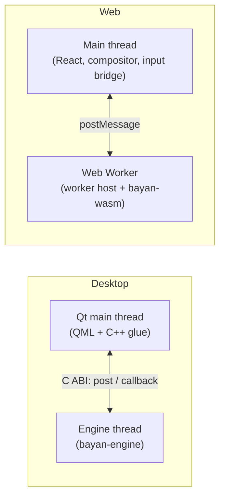
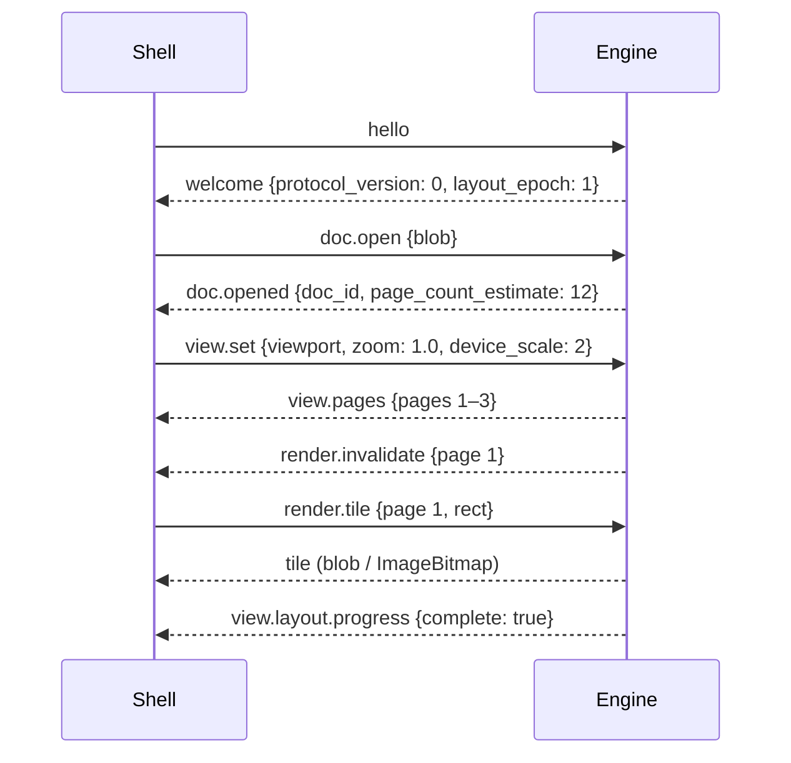

# Engine Protocol — v0

- **Status:** Draft v0. Implemented as a skeleton by CORE-007 and exercised by DESK-002 and WEB-002; promoted to v1 by CORE-125.
- **Owner stream:** UI / engine
- **Related:** ADR-0012, ADR-0019, ADR-0021, [plan/03-architecture.md §8](../plan/03-architecture.md#8-the-engine-boundary)

## 1. Goals

- One contract for both shells, so behavior cannot drift.
- Thin shells: all document behavior is in the engine.
- Asynchronous, so the interface never blocks on the engine.
- Recordable and replayable across platforms.
- Versioned and additive.

## 2. Topology



Messages are identical in both topologies; only the transport differs.

## 3. Transport

| | Desktop (C ABI, `bayan-ffi`) | Web (`bayan-wasm` in a worker) |
|---|---|---|
| Shell → engine | `bayan_engine_post(engine, json_ptr, json_len)` | `worker.postMessage(message)` |
| Engine → shell | callback `on_message(user_data, json_ptr, json_len)` invoked on the engine thread; the shell copies and marshals to the main thread | `self.postMessage(message)` from the worker host |
| Blobs | `bayan_blob_put(engine, bytes, len) → blob_id`, `bayan_blob_get(engine, blob_id, out)`, `bayan_blob_release` | transferable `ArrayBuffer`s attached to messages |
| Tiles | `bayan_render_tile(engine, request_json, rgba_out, stride)` into a caller-provided buffer (premultiplied RGBA8) | `ImageBitmap` produced in the worker and transferred |
| Lifecycle | `bayan_engine_new(config_json) → engine`, `bayan_engine_free(engine)`, `bayan_version()` | worker creation and termination |

All strings are UTF-8 JSON. Pointers passed to the engine are borrowed for the duration of the call only.

## 4. Envelope

```json
{ "v": 1, "id": 42, "type": "cmd.exec", "payload": { "command": "format.bold.toggle" } }
```

- `v`: protocol version.
- `id`: request identifier chosen by the sender (omitted for fire-and-forget events).
- `type`: dotted message type (§6).
- Replies: `{ "v": 1, "re": 42, "ok": true, "payload": { … } }` or `{ "v": 1, "re": 42, "ok": false, "error": { "code": "…", "message_id": "…", "args": { … } } }`. Error text is a Fluent message identifier, never raw content.
- Events from the engine have no `re` and may carry a monotonically increasing `seq`.

## 5. Handshake

1. Shell sends `hello` with `{ protocol_versions: [1], shell: { name, version, platform }, capabilities: { clipboard_formats, ime, accessibility, … }, locale, theme }`.
2. Engine replies `welcome` with `{ protocol_version, engine_version, layout_epoch, features }`.
3. If no common protocol version exists, the engine replies with an error and the shell shows an update prompt.

## 6. Message catalog (v0)

Only the messages needed by Phase 0–1 are defined here; editing messages are added in Phase 2.

### Documents

| Type | Direction | Payload |
|---|---|---|
| `doc.open` | → | `{ blob, format_hint?, file_name_hint? }` (file names are used only for format detection and display, never logged) |
| `doc.opened` | ← | `{ doc_id, page_count_estimate, warnings: [ { message_id, args } ], fonts: { missing: […], machine_dependent: bool } }` |
| `doc.prompt` | ← | `{ prompt_id, kind: "password" \| "external_content" \| …, args }` |
| `doc.prompt.answer` | → | `{ prompt_id, answer }` |
| `doc.save` | → | `{ doc_id, format, options }` → reply `{ blob }` |
| `doc.close` | → | `{ doc_id }` |

### View

| Type | Direction | Payload |
|---|---|---|
| `view.set` | → | `{ doc_id, viewport: { x, y, width, height } (device-independent pixels), zoom, device_scale, mode: "print" \| "web" \| "draft" \| "focus", show_formatting_marks }` |
| `view.layout.progress` | ← | `{ doc_id, pages_laid_out, page_count_estimate, complete }` |
| `view.pages` | ← | `{ doc_id, pages: [ { index, width, height (BLU), section } ] }` |
| `render.invalidate` | ← | `{ doc_id, regions: [ { page, rect } ] }` |
| `render.tile` | → | `{ doc_id, page, rect, zoom, device_scale, mode: "reference" \| "interactive" }` → reply with tile (blob or bitmap) |
| `overlay.update` | ← | `{ doc_id, caret: { page, rect, visible }, selection: [ { page, rects } ], remote: [ … ], highlights: [ … ] }` |

### Input (pointer and keyboard; text input arrives in Phase 2)

| Type | Direction | Payload |
|---|---|---|
| `input.pointer` | → | `{ doc_id, kind: "down" \| "move" \| "up" \| "cancel", x, y, button, clicks, modifiers, pointer_type }` |
| `input.key` | → | `{ doc_id, key, code, modifiers, repeat, composing }` |
| `input.text` | → | `{ doc_id, text }` (committed text) |
| `input.composition` | → | `{ doc_id, phase: "start" \| "update" \| "end", text, selection }` |
| `input.ime.query` | ← / → | engine reports caret rectangle and surrounding text for the input method |

### Commands and queries

| Type | Direction | Payload |
|---|---|---|
| `cmd.exec` | → | `{ doc_id, command, args }` (command identifiers come from the UI manifest) |
| `cmd.states` | ← | `{ doc_id, states: { command_id: { enabled, checked, value } } }` (pushed when they change) |
| `query.outline` | → | `{ doc_id }` → headings with page numbers |
| `query.find` | → | `{ doc_id, text, options }` → matches as ranges |
| `query.a11y` | → | `{ doc_id, range }` → accessibility subtree |
| `a11y.update` | ← | incremental accessibility tree changes |
| `ui.manifest` | → | `{ locale }` → the UI manifest with formatted strings |
| `i18n.format` | → | `{ message_id, args, locale }` → formatted string |

### Host services (engine asks, shell answers)

| Type | Direction | Payload |
|---|---|---|
| `host.font.request` | ← | `{ request_id, family, weight, style, script }` → shell replies with font blob or `not_found` |
| `host.clipboard.write` | ← | `{ items: [ { mime, blob } ] }` |
| `host.clipboard.read` | ← | `{ request_id, mimes }` → shell replies with items |
| `host.open_url` | ← | `{ url }` (shell confirms with the user before opening) |
| `host.timer` | ← | `{ timer_id, after_ms }` → shell later sends `host.timer.fired` |
| `host.net.send` / `net.received` | ← / → | opaque byte frames for sync (Phase 3) |
| `host.ai.infer` | ← | inference request (Phase 5) |

### Diagnostics

| Type | Direction | Payload |
|---|---|---|
| `diag.record.start` / `diag.record.stop` | → | start or stop recording to a blob; reply with the recording |
| `diag.log` | ← | structured log records without document content |
| `engine.error` | ← | `{ code, message_id, recoverable }` (including caught panics) |

## 7. Coordinates and units

- Viewport coordinates are device-independent pixels (CSS pixels on the web, Qt logical pixels on desktop) relative to the scroll origin of the page area; `device_scale` gives physical pixels per logical pixel.
- Document geometry in queries is in BLU (ADR-0005) with page index.
- The engine owns hit-testing; shells never interpret document geometry beyond drawing tiles and overlays.

## 8. Threading and re-entrancy

- The engine processes inbound messages in order on its own thread or worker.
- Callbacks must not call back into the engine synchronously; shells queue work to their main thread.
- Tile rendering may run on engine worker threads; results are delivered asynchronously.

## 9. Versioning

- Protocol version 1 is the first stable version (Phase 1 exit). Version 0 is unstable and may change between core releases.
- Within a version, only additive changes are allowed: new message types, new optional fields. Shells ignore unknown fields and unknown event types.
- Every core release publishes the JSON Schema and TypeScript declarations for its protocol.

## 10. Record and replay

`diag.record.start` makes the engine capture every inbound message, host-service reply, timer firing and blob (in order, with timestamps) into a recording. Replaying it on any platform with the same engine version must reproduce identical layout hashes. Recordings contain document content; they are created only on explicit user or developer action and never uploaded automatically.

## 11. Example: opening a document and rendering the first page


