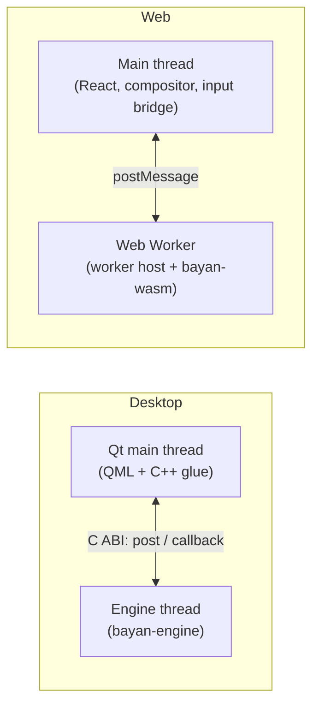
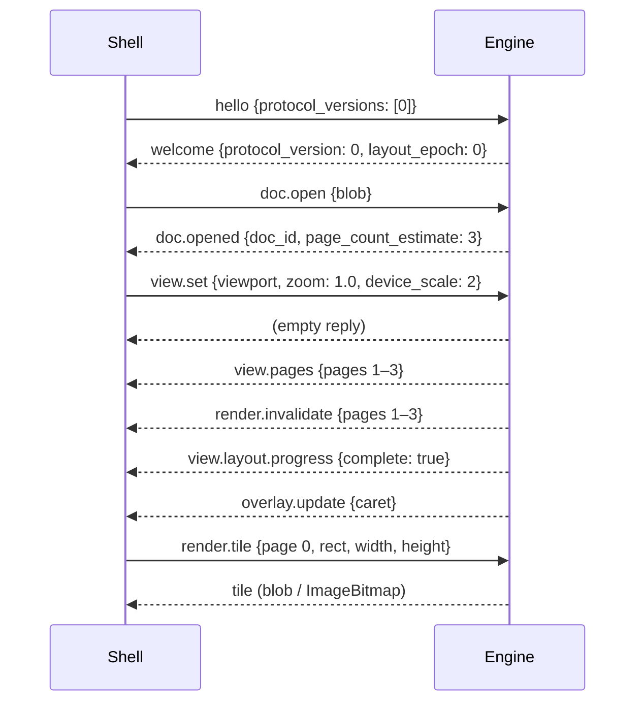

# Engine Protocol — v0

- **Status:** Draft v0. CORE-007 implemented the skeleton and fixed the details of v0 recorded here (2026-10-07); DESK-002 and WEB-002 exercise it; CORE-125 promotes it to v1. Version 0 is unstable and may still change between core releases (§9).
- **Owner stream:** UI / engine
- **Related:** ADR-0012, ADR-0019, ADR-0021, [plan/03-architecture.md §8](../plan/03-architecture.md#8-the-engine-boundary)

## 1. Goals

- One contract for both shells, so behavior cannot drift.
- Thin shells: all document behavior is in the engine.
- Asynchronous, so the interface never blocks on the engine.
- Recordable and replayable across platforms.
- Versioned and additive.

## 2. Topology



Messages are identical in both topologies; only the transport differs.

## 3. Transport

| | Desktop (C ABI, `bayan-ffi`) | Web (`bayan-wasm` in a worker) |
|---|---|---|
| Shell → engine | `bayan_engine_post(engine, json, json_len)` | `worker.postMessage(message)` |
| Engine → shell | the callback registered with `bayan_engine_set_callback`, `callback(user_data, json, json_len)`, invoked on the engine thread; the shell copies and marshals to the main thread | `self.postMessage(message)` from the worker host |
| Blobs | `bayan_blob_put(engine, bytes, len) → blob_id`, `bayan_blob_get(engine, blob_id, out, out_capacity, out_len)`, `bayan_blob_release(engine, blob_id)` | transferable `ArrayBuffer`s in the messages' `blob` fields (§3.2) |
| Tiles | `bayan_render_tile(engine, request_json, request_len, rgba_out, out_capacity, width, height, stride)` into a caller-provided buffer (premultiplied RGBA8), or the `render.tile` message, whose reply carries the pixels as a blob | `ImageBitmap` produced in the worker and transferred, in the reply to `render.tile` |
| Lifecycle | `bayan_engine_new(config_json, config_len) → engine`, `bayan_engine_free(engine)`, `bayan_version()` | worker creation, the optional `init` control message (§3.2), and termination |

All strings are UTF-8 JSON, passed with an explicit length and not NUL-terminated (except the static string `bayan_version` returns). Pointers passed to the engine are borrowed for the duration of the call only.

### 3.1 The C interface

`bayan-ffi` exports exactly these nine functions with C linkage and the platform's standard C calling convention; cbindgen generates `bayan_ffi.h` from the Rust code, and the C SDK ships it (ADR-0002). The declarations below are copied from that header; the header's comments are the authoritative per-function documentation.

```c
typedef struct BayanEngine BayanEngine;      /* opaque */
typedef uint64_t BayanBlobId;                /* 0 is never a valid blob */
typedef int32_t BayanStatus;
#define BAYAN_STATUS_OK 0
#define BAYAN_STATUS_INVALID_ARGUMENT 1      /* a null pointer, a malformed request, or a size outside the limits (§13) */
#define BAYAN_STATUS_NOT_FOUND 2             /* unknown blob, document or page */
#define BAYAN_STATUS_BUFFER_TOO_SMALL 3      /* the output buffer is too small; the function says how to learn the size needed */
#define BAYAN_STATUS_INTERNAL_ERROR 4        /* the engine failed or is stopping */
#define BAYAN_STATUS_WRONG_THREAD 5          /* called from inside the engine's callback, where it would wait for itself */
typedef void (*BayanMessageCallback)(void *user_data, const uint8_t *json, size_t json_len);

const char *bayan_version(void);
BayanEngine *bayan_engine_new(const uint8_t *config_json, size_t config_len);
void bayan_engine_free(BayanEngine *engine);
BayanStatus bayan_engine_set_callback(BayanEngine *engine, BayanMessageCallback callback, void *user_data);
BayanStatus bayan_engine_post(BayanEngine *engine, const uint8_t *json, size_t json_len);
BayanBlobId bayan_blob_put(BayanEngine *engine, const uint8_t *bytes, size_t len);
BayanStatus bayan_blob_get(BayanEngine *engine, BayanBlobId blob, uint8_t *out, size_t out_capacity, size_t *out_len);
BayanStatus bayan_blob_release(BayanEngine *engine, BayanBlobId blob);
BayanStatus bayan_render_tile(BayanEngine *engine, const uint8_t *request_json, size_t request_len, uint8_t *rgba_out,
                              size_t out_capacity, uint32_t width, uint32_t height, size_t stride);
```

These signatures adopt the provisional header that DESK-001 wrote for its stub engine, unchanged, and add `BAYAN_STATUS_WRONG_THREAD`. Rules for callers:

- `bayan_engine_new` takes the engine configuration (§3.3); a null pointer with length 0 means the defaults. It returns NULL if the configuration is invalid or the engine thread cannot start.
- Register the callback before the first `bayan_engine_post`: until then a later registration replaces an earlier one, and once a message has been posted, registering returns `BAYAN_STATUS_INVALID_ARGUMENT`. `user_data` is passed back unchanged and must be usable from the engine thread.
- `bayan_engine_post` copies the message, queues it and returns without waiting.
- The callback runs on the engine thread, one message at a time. The `json` pointer is valid only during the call: copy the bytes and hand them to your own thread. The callback must not let a C++ exception escape.
- `bayan_blob_put` copies the bytes into a new blob and returns its identifier, or 0 if `bytes` is NULL while `len` is not 0, or the blob is too large or there are too many (§13). An empty blob is allowed, and then `bytes` may be NULL. Blob 0 never names a blob: it stands for bytes that could not be stored, and the engine answers a message that names blob 0 with `limit_exceeded` (`args.limit`: `blob`). The engine numbers blobs that shells put with odd identifiers and blobs it creates itself with even ones, so that recordings replay with identical identifiers (§10).
- `bayan_blob_get` copies a blob's bytes into `out`, which has room for `out_capacity` bytes, and sets `*out_len` to the blob's size. If the blob does not fit (a NULL `out` has room for nothing) it returns `BAYAN_STATUS_BUFFER_TOO_SMALL`, so callers can ask for the size first; an empty blob always fits, so asking for its size returns `BAYAN_STATUS_OK`. The output buffers of `bayan_blob_get` and `bayan_render_tile` need not be initialized. Blobs the engine creates (recordings, message-path tiles) belong to the shell, which releases them with `bayan_blob_release`.
- `bayan_render_tile` renders the tile that a `render.tile` payload describes (§6.4) into `rgba_out` and returns when it is done. `width` and `height` give the tile's size in pixels (the payload's own `width` and `height` may be omitted; if present they must be equal). `stride` is the distance between the starts of two rows in bytes, at least `4 × width`, and `out_capacity` is at least `stride × (height − 1) + 4 × width`. The request is processed on the engine thread, in order with the posted messages (§8), so it waits for messages posted before it. Inside any engine's callback it returns `BAYAN_STATUS_WRONG_THREAD` instead of waiting (§8).
- Every function may be called from any thread, also from several threads at once, except `bayan_engine_free`.
- `bayan_engine_free` stops the engine thread and destroys the engine; it accepts NULL. It must be the last call on an engine: apart from the engine's own callback, no other thread may be inside a call on that engine, and nothing may use the engine afterwards (a callback that frees the engine must first make sure of this). Called from any other thread, it waits until the engine thread has stopped; the callback may still be running meanwhile, and a `bayan_engine_post` it makes then fails with `BAYAN_STATUS_INTERNAL_ERROR`. Called from inside the callback, it returns at once and the engine thread finishes by itself. Either way, the callback is never called again after `bayan_engine_free` returns.
- No function lets a Rust panic escape: each entry point catches panics and returns `BAYAN_STATUS_INTERNAL_ERROR`, NULL or 0, and a panic while the engine thread handles a message becomes an `engine.error` event (§12). Panics inside the engine are not printed either, because a panic's message could quote document content: the first `bayan_engine_new` installs a Rust panic hook that stays silent for the engine's threads and calls, and hands every other panic in the process to the hook installed before it.

### 3.2 The web transport

The WebAssembly package contains the engine (`bayan_wasm_bg.wasm`), its wasm-bindgen glue (`bayan_wasm.js`) and the worker host (`bayan-worker.js`), a dependency-free module worker script that relays messages between the main thread and the engine. The main thread never calls the engine directly (ADR-0012).

- **Starting:** create the worker with `new Worker(<URL of bayan-worker.js>, { type: "module" })`. The first message may be the control message `{ "worker": "init", "config": { … }, "wasm_url": "…" }`, both fields optional: `config` is the engine configuration (§3.3) and `wasm_url` the address of `bayan_wasm_bg.wasm`, resolved against the worker script's address (default: next to the script). Without it, the worker host initializes with the defaults when the first protocol message arrives. It answers `{ "worker": "ready", "engine_version": "…" }`, or `{ "worker": "failed", "reason": "…" }` with one of the fixed reasons `invalid_config`, `load_failed` (the engine module could not be loaded) and `restart_failed` (the engine could not be replaced after a panic); after `failed` the worker host ignores every message, and the shell terminates the worker. Messages sent before it is ready are queued. Control messages have a `worker` field and no `v`, so they cannot be mistaken for protocol messages; only the very first message, of any kind, may be `init`, and any other control message is ignored.
- **Messages** are plain objects with the shapes of §4, sent with `postMessage` (structured clone); no JSON text crosses the worker boundary. The worker host handles them one at a time and delivers each message's answers in order, before it handles the next message. A message that JSON cannot represent (for example one holding a `BigInt`) reaches the engine as unreadable and is answered with `invalid_message` (§12). A message whose JSON text is longer than the 16 MiB limit (§13) is not copied into the engine at all: the worker host answers it with `limit_exceeded` (`args.limit`: `message_size`), as the reply if it has an `id`, otherwise as `engine.error`; in the second case a running recording stops there and is marked truncated, because it cannot hold a message the engine never saw.
- **Blobs:** wherever a payload has a `blob` field, the web carries an `ArrayBuffer` in it instead of a blob identifier, in both directions; list it in the transfer list. The worker host converts between the two: it stores an incoming `ArrayBuffer` as a blob for the message and releases it once the message is handled, and it takes every blob the engine sends out of the engine. An `ArrayBuffer` it cannot store (larger than 64 MiB, or beyond another blob limit of §13) becomes blob 0, which the engine answers with `limit_exceeded`.
- **Tiles:** the reply to `render.tile` carries `bitmap`, a transferred `ImageBitmap`, instead of `blob` and `stride`. The worker host converts the engine's premultiplied pixels into the `ImageData` format (non-premultiplied) before creating the bitmap; pixels with alpha 0 or 255 are unchanged. If the browser cannot create the bitmap, the request is answered with the error `internal` instead.
- **Panics:** a panic in the WebAssembly engine stops its instance. The worker host then replaces the engine instance with a new one created from the same configuration, and the new engine replies to the message that caused the panic (if it had an `id`) with the error `panic` and sends `engine.error` with `recoverable: false` (§12), its first event (`seq` 1). The worker host then continues with the next message.

### 3.3 Engine configuration

The engine receives all configuration from the host when it is created (architecture §12); it reads no environment variables. The configuration is a JSON object; every field is optional:

| Field | Meaning |
|---|---|
| `test.allow_panic` | `true` lets `diag.panic` (§6.7) make the engine panic, for tests of the error path. Default `false`. |

Unknown fields at the top level are ignored, so a newer shell can configure an older engine. An unknown field inside `test`, or a value of the wrong type, makes creation fail, so that a misspelt test switch cannot silently test the normal path.

## 4. Envelope

```json
{ "v": 0, "id": 42, "type": "doc.open", "payload": { "blob": 7 } }
```

- `v`: protocol version, `0` for this draft.
- `id`: request identifier chosen by the sender, a positive integer below 2⁵³ (so JavaScript numbers hold it exactly). Omitted for fire-and-forget messages. A request whose reply would carry a blob (`render.tile`, `diag.record.stop`) sent without an `id` is still carried out, but the engine keeps no blob for it, since nobody could learn its identifier to release it.
- `type`: dotted message type (§6).
- `payload`: an object; it may be omitted when it would be empty.
- Replies: `{ "v": 0, "re": 42, "ok": true, "payload": { … } }` or `{ "v": 0, "re": 42, "ok": false, "error": { "code": "…", "message_id": "…", "args": { … } } }`. Where §6 names a reply (`welcome`, `doc.opened`), the reply also carries that name in `type`. Error text is a Fluent message identifier, never raw content; `args` holds only codes and numbers (§12).
- Events from the engine have no `re` and carry `seq`, which increases by one with every event an engine instance sends, starting at 1. `seq` is diagnostic: it starts again at 1 when the web worker host replaces a crashed instance.
- A message the engine cannot handle without an `id` has nobody to reply to; the engine reports the problem as an `engine.error` event with `recoverable: true` instead.
- Both sides ignore fields they do not know.

## 5. Handshake

1. Shell sends `hello` with `{ protocol_versions: [0], shell: { name, version, platform }, capabilities: { clipboard_formats, ime, accessibility, … }, locale, theme }`.
2. Engine replies `welcome` with `{ protocol_version, engine_version, layout_epoch, features }`.
3. If no common protocol version exists, the engine replies with the error `unsupported_protocol_version` and the shell shows an update prompt.

Until the handshake has succeeded, every other message is answered with the error `handshake_required`. A later `hello` starts a new session: the engine closes every document first.

## 6. Message catalog (v0)

Only the messages needed by Phase 0–1 are defined here; editing messages are added in Phase 2. The v0 skeleton (CORE-007) implements the messages marked **v0**; the others are answered with the error `unsupported_message` until their work package adds them. Until real documents can be opened, `doc.open` opens a fixed multi-page mock document (described in bayan-core's `bayan-engine` documentation), so that the shells can be built and tested end to end.

The precise shape of every v0 payload is the JSON Schema `engine-protocol.schema.json`, generated from the engine's Rust types and shipped in the C SDK and the WebAssembly package together with the TypeScript declarations `engine-protocol.d.ts` (§9). §6.1–§6.8 give their meaning; all geometry is in BLU and all text offsets in UTF-16 code units (§7).

### Documents

| Type | Direction | Payload |
|---|---|---|
| `doc.open` **v0** | → | `{ blob, format_hint?, file_name_hint? }` (file names are used only for format detection and display, never logged) |
| `doc.opened` **v0** | ← | the reply to `doc.open`: `{ doc_id, page_count_estimate, warnings: [ { message_id, args } ], fonts: { missing: […], machine_dependent: bool } }` |
| `doc.prompt` | ← | `{ prompt_id, kind: "password" \| "external_content" \| …, args }` |
| `doc.prompt.answer` | → | `{ prompt_id, answer }` |
| `doc.save` | → | `{ doc_id, format, options }` → reply `{ blob }` |
| `doc.close` **v0** | → | `{ doc_id }` → empty reply |

### View

| Type | Direction | Payload |
|---|---|---|
| `view.set` **v0** | → | `{ doc_id, viewport: { x, y, width, height } (device-independent pixels), zoom, device_scale, mode: "print" \| "web" \| "draft" \| "focus", show_formatting_marks }` → empty reply, followed by `view.pages`, `render.invalidate`, `view.layout.progress` and `overlay.update` |
| `view.layout.progress` **v0** | ← | `{ doc_id, pages_laid_out, page_count_estimate, complete }` |
| `view.pages` **v0** | ← | `{ doc_id, pages: [ { index, width, height (BLU), section, x, y (BLU, the page's position in view space, §7) } ] }` |
| `render.invalidate` **v0** | ← | `{ doc_id, regions: [ { page, rect } ] }` |
| `render.tile` **v0** | → | `{ doc_id, page, rect, width, height, zoom, device_scale, mode: "reference" \| "interactive" }` → reply with the tile (§6.4) |
| `overlay.update` **v0** | ← | `{ doc_id, caret: { page, rect, visible } \| null, selection: [ { page, rects } ], remote: [ … ], highlights: [ … ] }` |

### Input (in v0, pointer, keyboard and text input reach the mock document's editable line; editing real documents arrives in Phase 2)

| Type | Direction | Payload |
|---|---|---|
| `input.pointer` **v0** | → | `{ doc_id, kind: "down" \| "move" \| "up" \| "cancel", x, y, button, clicks, modifiers, pointer_type }` |
| `input.key` **v0** | → | `{ doc_id, key, code, modifiers, repeat, composing }` |
| `input.text` **v0** | → | `{ doc_id, text }` (committed text) |
| `input.composition` **v0** | → | `{ doc_id, phase: "start" \| "update" \| "end", text, selection }` |
| `input.ime.query` | ← / → | engine reports caret rectangle and surrounding text for the input method |

### Commands and queries

| Type | Direction | Payload |
|---|---|---|
| `cmd.exec` | → | `{ doc_id, command, args }` (command identifiers come from the UI manifest) |
| `cmd.states` | ← | `{ doc_id, states: { command_id: { enabled, checked, value } } }` (pushed when they change) |
| `query.outline` | → | `{ doc_id }` → headings with page numbers |
| `query.find` | → | `{ doc_id, text, options }` → matches as ranges |
| `query.a11y` **v0** | → | `{ doc_id, node? }` → accessibility subtree (§6.6) |
| `a11y.update` **v0** | ← | incremental accessibility tree changes (§6.6) |
| `ui.manifest` **v0** | → | `{ locale }` → the UI manifest with formatted strings (a stub in v0, §6.8) |
| `i18n.format` | → | `{ message_id, args, locale }` → formatted string |

### Host services (engine asks, shell answers)

| Type | Direction | Payload |
|---|---|---|
| `host.font.request` | ← | `{ request_id, family, weight, style, script }` → shell replies with font blob or `not_found` |
| `host.clipboard.write` | ← | `{ items: [ { mime, blob } ] }` |
| `host.clipboard.read` | ← | `{ request_id, mimes }` → shell replies with items |
| `host.open_url` | ← | `{ url }` (shell confirms with the user before opening) |
| `host.timer` | ← | `{ timer_id, after_ms }` → shell later sends `host.timer.fired` |
| `host.net.send` / `net.received` | ← / → | opaque byte frames for sync (Phase 3) |
| `host.ai.infer` | ← | inference request (Phase 5) |

### Diagnostics

| Type | Direction | Payload |
|---|---|---|
| `diag.record.start` / `diag.record.stop` **v0** | → | start or stop recording; the reply to `stop` carries the recording as a blob (§6.7, §10) |
| `diag.replay` **v0** | → | `{ blob }`: replay a recording in a separate session → reply with a comparison report (§6.7, §10) |
| `diag.panic` **v0** | → | make the engine panic, for tests of the error path; only when the configuration allows it (§3.3, §6.7) |
| `diag.log` | ← | structured log records without document content |
| `engine.error` **v0** | ← | `{ code, message_id, recoverable, args }` (including caught panics, §12) |

### 6.1 Handshake and documents

- `hello`: `protocol_versions` must contain 0; `shell`, `capabilities`, `locale` and `theme` are optional and do not change the v0 engine's behavior. `welcome` answers with `protocol_version: 0`, `engine_version` (the core's semantic version), `layout_epoch` (0 until the first real layout engine, ADR-0004 §4) and `features`, a list of strings (the skeleton reports `mock_document` and `record_replay`).
- `doc.open`: `blob` must name an existing blob; the skeleton ignores its bytes, `format_hint` and `file_name_hint`, and opens a new copy of the mock document. `doc_id`s are positive integers, never reused within a session.
- `doc.close`: forgets the document; later messages naming it get the error `not_found`.

### 6.2 View

- `view.set`: `zoom` and `device_scale` are finite and positive (zoom from 0.05 to 64, device scale up to 16); the viewport is in device-independent pixels relative to the view origin (§7). The skeleton lays out every page at once, so it answers with all pages and `complete: true`, and it invalidates every page.
- `view.pages`: `index` counts from 0; `section` is the index of the page's section (0 in the mock); `x` and `y` place the page in view space (§7).
- `render.invalidate`: rectangles in page coordinates; the shell re-requests the tiles that intersect them.

### 6.3 Overlays

`overlay.update` describes what the shell draws over the tiles (ADR-0011 §5): `caret` (or `null` when there is none), `selection` rectangles per page, and, from later phases, `remote` cursors and find `highlights`, which are empty in v0. The engine sends it after `view.set` and whenever the caret or selection changes.

### 6.4 Tiles

`render.tile` asks for the pixels of `rect` (page coordinates) of page `page`, `width` × `height` pixels in size (each from 1 to 4,096). The scale is defined by `rect` and the pixel size alone (§7); `zoom`, `device_scale` and `mode` are hints for later rasterizers (ADR-0011 §3) and do not change v0's output. In the message form, `width` and `height` are required. The reply is `{ width, height, stride, hash, blob }`: the pixels as an engine-created blob, `stride = 4 × width` bytes per row, and `hash`, the digest of the pixels (§10). On the web, `blob` and `stride` are replaced by `bitmap` (§3.2).

### 6.5 Input

- `input.pointer`: `x` and `y` are in device-independent pixels relative to the view origin; `button` is 0 for the primary button (as in the DOM's `button`), `clicks` the click count, `pointer_type` `"mouse"`, `"pen"` or `"touch"`, and `modifiers` an object of booleans `{ shift, ctrl, alt, meta }`. The engine needs a `view.set` first to know the zoom.
- `input.key`: `key` and `code` use the values of the DOM's `KeyboardEvent` (`"Backspace"`, `"ArrowLeft"`, `"KeyA"`, …). While `composing` is true, the input method owns the key and the engine ignores it. Committed text arrives as `input.text`, never as `input.key`.
- `input.text`: inserts committed text at the caret. If a composition is active, the text replaces it and ends it.
- `input.composition`: `start` begins a composition at the caret, `update` replaces its text (`text`) and its selection (`selection: { start, end }`, offsets into `text`), and `end` ends it and discards its text; the committed text arrives separately as `input.text`.

### 6.6 Accessibility

`query.a11y` returns `{ doc_id, root, caret }`: the subtree rooted at node `node` (the whole document when `node` is omitted) and the accessibility caret `{ node, offset }` (or `null`). A node is `{ id, role, level?, name?, text?, editable?, bounds?, chars?, children? }`:

- `id`: a positive integer, stable for the node's lifetime.
- `role`: one of `document`, `heading`, `paragraph`, `list`, `list_item`, `table`, `row`, `column_header`, `cell`; `level` gives a heading's level (1–9).
- `name`: an accessible name where the content does not provide one (the document, an editable field).
- `text`: the node's own text, on nodes that hold text; `editable` marks text the user can edit.
- `bounds`: `{ page, rect }`, the node's box; `chars`: the box of every character, `[ { start, end, rect } ]`, with `start` and `end` offsets into `text` and rectangles on the page of `bounds`.

`a11y.update` is `{ doc_id, changes: [ { kind: "replace", node } ], caret }`: each change replaces the node with the same `id`, children included. v0 sends it when the editable text, the composition or the caret changes.

### 6.7 Diagnostics

- `diag.record.start`: starts recording (§10); the error `already_recording` if a recording is running.
- `diag.record.stop`: stops it and replies `{ blob, entries, truncated }`: the recording as an engine-created blob, the number of entries, and whether a limit (§13) cut it short. The error `not_recording` if none is running.
- `diag.replay`: replays the recording in `blob` in a separate session that does not touch the shell's documents, and replies `{ entries, identical, first_difference, tiles }`: whether every entry produced exactly what it produced when it was recorded, the index of the first entry that did not (or `null`), and `[ { entry, page, width, height, hash } ]` for every tile rendered during the replay. The errors `invalid_recording` and `recording_mismatch` (§10). Not allowed while recording.
- `diag.panic`: panics inside its message handler, so tests can check §12's recovery. Without `test.allow_panic` (§3.3) the engine answers with the error `not_allowed` instead.

### 6.8 UI manifest

`ui.manifest` answers in v0 with a stub, `{ manifest_version: 0, locale, commands: [ { id, label, shortcut? } ], ribbon: { tabs: [ { id, label, groups: [ { id, label, commands: [ id ] } ] } ] } }`, in English whatever `locale` asks for, so that the shells can try rendering a ribbon from data. ADR-0019's real manifest (`bayan-ui`, Phase 2) replaces it.

## 7. Coordinates and units

- Viewport coordinates are device-independent pixels (CSS pixels on the web, Qt logical pixels on desktop) relative to the scroll origin of the page area, the **view origin**; `device_scale` gives physical pixels per logical pixel.
- **View space** is the page area at zoom 1, measured in BLU from the view origin. `view.pages` gives each page's top-left corner in view space (`x`, `y`); the shell draws page `p` with its top-left corner at `x × zoom / 19,050` and `y × zoom / 19,050` device-independent pixels. A device-independent pixel is 19,050 BLU at zoom 1 (1/96 inch), so a viewport or pointer coordinate `d` is the view-space coordinate `d × 19,050 / zoom`. A shell may move the whole page area (for example to center it), as long as it moves the pointer coordinates it sends by the same amount.
- Document geometry in queries is in BLU (ADR-0005) with page index.
- **Tiles:** a tile of `width` × `height` pixels covering `rect` (page coordinates) maps pixel column `i` to the page interval from `rect.x + i × rect.width / width` to `rect.x + (i + 1) × rect.width / width`, and rows likewise. Pixels are premultiplied RGBA8, rows from top to bottom; anything outside the page is transparent (all four bytes 0).
- **Text offsets** (caret, composition selection, accessibility) count UTF-16 code units, as strings in JavaScript and Qt do, and never fall inside a surrogate pair.
- The engine owns hit-testing; shells never interpret document geometry beyond drawing tiles and overlays.

## 8. Threading and re-entrancy

- The engine processes inbound messages in order on its own thread or worker.
- Callbacks must not call back into the engine synchronously; shells queue work to their main thread.
- On desktop, `bayan_engine_new` starts the engine thread, and `bayan_engine_post` and `bayan_render_tile` hand their work to it, in the order they are called. The callback runs on that thread. From inside the callback, a shell may post (the message runs after the current one) and use the blob functions, but `bayan_render_tile` returns `BAYAN_STATUS_WRONG_THREAD` inside any engine's callback, because it would wait for the thread it is running on, or for another engine whose callback may be waiting for this one; `bayan_engine_free` of the callback's own engine stops it without waiting (§3.1).
- On the web, the worker host hands one message at a time to the engine, which runs inside the worker; the main thread is never blocked.
- Tile rendering may run on engine worker threads in later versions; results are delivered asynchronously. In v0, `bayan_render_tile` blocks its caller until the engine thread has rendered the tile.

## 9. Versioning

- Protocol version 1 is the first stable version (Phase 1 exit). Version 0 is unstable and may change between core releases.
- Within a version, only additive changes are allowed: new message types, new optional fields. Shells ignore unknown fields and unknown event types.
- Every core release publishes the JSON Schema (draft 2020-12) and TypeScript declarations for its protocol. Both are generated from the engine's Rust types, checked by tests against the code, and shipped as `engine-protocol.schema.json` and `engine-protocol.d.ts` in the C SDK and the WebAssembly package.

## 10. Record and replay

`diag.record.start` makes the engine capture every inbound message, host-service reply, timer firing and blob (in order, with timestamps) into a recording. Replaying it on any platform with the same engine version must reproduce identical layout hashes. Recordings contain document content; they are created only on explicit user or developer action and never uploaded automatically.

In v0 a recording is a JSON object:

| Field | Content |
|---|---|
| `format`, `format_version` | `"bayan-engine-recording"`, `1` |
| `engine_version`, `protocol_version`, `layout_epoch` | the engine that recorded it |
| `initial_state` | the engine's session state when recording started (engine-defined), so a recording can start in the middle of a session |
| `blobs` | `[ { id, base64 } ]`: every blob a recorded message used, captured when the message was handled |
| `entries` | `[ { t_ms, kind, text, width?, height?, digest } ]`: each inbound message (`kind: "message"`, its exact JSON in `text`, or `base64` if it was not UTF-8) and each `bayan_render_tile` call (`kind: "tile"`, its request with `width` and `height`), in the order the engine handled them |
| `truncated` | `true` if a limit (§13) stopped the recording early |

- `t_ms` is the time since recording started, in milliseconds, from a clock the host binding supplies (the desktop binding's monotonic clock, the web worker host's `performance.now()`); the engine itself never reads a clock.
- `digest` records what the entry produced: for messages, a digest of every message the engine sent while handling it; for tiles, the digest of the pixels, or the status code if rendering failed.
- Digests and tile hashes are written `fnv1a64:` followed by 16 hexadecimal digits: the 64-bit FNV-1a hash of the bytes (for tiles, the rows of pixels without padding, top to bottom). FNV-1a is not a cryptographic hash; it detects accidental differences, and recordings make no claim against deliberate tampering.
- `diag.replay` refuses a recording that cannot be read or exceeds the limits (`invalid_recording`) and one from another engine version, protocol version or layout epoch (`recording_mismatch`, with the differing field in `args`). Otherwise it restores `initial_state` and the blobs in a new, separate session with the replaying engine's own configuration (§3.3), handles every entry again, and compares each digest. Recordings are untrusted input: they are read with the limits of §13, and a replay session cannot start another replay.

## 11. Example: opening a document and rendering the first page



## 12. Errors and recovery

Errors carry a `code`, for programs, and a `message_id`, a Fluent identifier the shell formats for people (ADR-0021). `args` carries only codes and numbers, never document content, file names or parts of the message that failed.

| `code` | `message_id` | Meaning |
|---|---|---|
| `invalid_message` | `engine-error-invalid-message` | not a JSON object of the envelope's shape (§4), or not UTF-8 |
| `unsupported_protocol_version` | `engine-error-unsupported-protocol-version` | `v` is not 0, or `hello` offers no common version (`args.supported` lists the engine's) |
| `handshake_required` | `engine-error-handshake-required` | a message other than `hello` before the handshake |
| `unsupported_message` | `engine-error-unsupported-message` | an unknown message type, or one v0 does not implement (`args.type`, cut to 64 characters) |
| `invalid_request` | `engine-error-invalid-request` | the payload does not have the message's shape, or a value is out of range (`args.type`) |
| `not_found` | `engine-error-not-found` | an unknown document, blob, page or node (`args.what`) |
| `limit_exceeded` | `engine-error-limit-exceeded` | a limit of §13 (`args.limit`) |
| `already_recording`, `not_recording` | `engine-error-already-recording`, `engine-error-not-recording` | `diag.record.start` or `stop` at the wrong time |
| `invalid_recording` | `engine-error-invalid-recording` | `diag.replay` cannot read the recording |
| `recording_mismatch` | `engine-error-recording-mismatch` | the recording comes from another engine version, protocol version or layout epoch (`args.field`) |
| `not_allowed` | `engine-error-not-allowed` | `diag.panic` without its test switch, or `diag.replay` while recording (`args.reason`) |
| `panic` | `engine-error-panic` | the engine panicked while handling the message |
| `internal` | `engine-error-internal` | any other failure inside the engine |

`engine.error` events say in `recoverable` what the shell must do. `true`: the engine kept its state and the shell can continue. `false`: the engine discarded its session (every document is closed, recordings included on the web) and the shell must start a new one with `hello`. A panic while handling a message is always `false` (ADR-0006 §4): the native engine catches it, answers the message with the error `panic` if it had an `id`, sends `engine.error`, and continues with a fresh session on the same thread; on the web, the worker host does the same with a new engine instance (§3.2). On desktop a recording that is running keeps running across the panic, so it can reproduce the crash.

## 13. Limits

The engine treats every message as untrusted input and enforces these limits (ADR-0006 §5):

| What | Limit |
|---|---|
| A message, in either direction | 16 MiB |
| A blob; all blobs together; the number of blobs | 64 MiB; 256 MiB; 1,024 |
| Open documents | 16 |
| A tile's width and height | 1 to 4,096 pixels each |
| A tile rectangle's coordinates; its width and height | within ±2⁴⁰ BLU; 1 to 2⁴⁰ BLU |
| A recording: entries; size as JSON | 100,000; 64 MiB |

A message over a limit is refused with `limit_exceeded` (or, on the C interface, `BAYAN_STATUS_INVALID_ARGUMENT`). The mock document adds its own limits for its editable text, listed in `bayan-engine`'s documentation.
