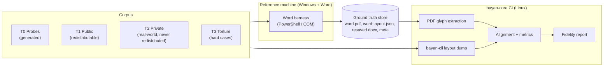

# Fidelity Lab — v1

- **Status:** v1. Built by LAB-001…LAB-005 in Phase 0 and LAB-101…LAB-109 in Phase 1.
- **Owner stream:** LAB
- **Related:** ADR-0004, ADR-0009, ADR-0025, [word-behavior/](word-behavior/README.md), [coverage-matrix.md](coverage-matrix.md)

## 1. Purpose

The Fidelity Lab turns "looks like Word" into numbers. It:

1. measures how closely BayanDocs lays out documents compared with Microsoft Word (Tier C);
2. discovers Word's undocumented behavior through controlled experiments and records it as Word Behavior Notes;
3. prevents regressions through CI gates;
4. supports the determinism matrix (Tier A) and round-trip checks (Tier B).

The lab is clean-room: it observes Word's output only. Nobody decompiles, disassembles or debugs Microsoft software.

## 2. Components

## 3. Corpus tiers

| Tier | What | Source | Stored | Size target (end of Phase 1) |
|---|---|---|---|---|
| T0 Probes | Small generated documents, each isolating one behavior | Probe generator in `lab/` | Generated on demand; ground truth stored | Thousands |
| T1 Public | Real or realistic documents with redistributable licenses | Test suites of open-source projects with compatible licenses, documents we author, public-domain government documents | Public object storage with a manifest in Git | 2,000 |
| T2 Private | Real-world documents found on the open web | Crawled samples | Private storage chosen by the owner; aggregate metrics only; never redistributed | 10,000+ |
| T3 Torture | Known-hard documents: legal contracts with heavy numbering, academic papers with equations and footnotes, books, forms, right-to-left and East Asian documents, heavy floating layouts | Mixed; licensing recorded | Per license (public or private) | 300 |

Every document has a **manifest entry**: SHA-256 (identity), source and license, tier, detected features (tables, floats, fields, footnotes, equations, scripts, compatibility mode, fonts used), Word build used for ground truth, and status.

Corpus hygiene: documents may contain malware or personal data. They are handled only on the isolated reference machine and in CI sandboxes, never opened with macros or external content enabled, and T2 metadata never includes content snippets.

## 4. Ground truth (reference machine)

The reference machine is a dedicated Windows 11 computer or virtual machine with a Microsoft 365 desktop Word at a pinned build (see LAB-002 for configuration). For each document the harness:

1. opens the document read-only with macros disabled, external content blocked, AutoSave and cloud features off, and no repair prompts accepted silently (repair prompts are recorded as findings);
2. exports PDF with document structure tags;
3. extracts a **layout skeleton** through Word's object model: page count, each page's starting character position, and line starts for sampled paragraphs;
4. optionally saves a re-saved copy (useful for round-trip studies and for Word's own `lastRenderedPageBreak` hints);
5. records metadata: Word build number, Windows build, installed font list with file hashes, timings, warnings.

Ground truth is generated once per document per Word build and stored as artifacts; CI never runs Word.

## 5. Layout JSON

Both the ground-truth extractor and `bayan-cli` emit the same **layout JSON** schema (defined by LAB-003), so comparisons are symmetric:

- document: page count, page sizes;
- per page: ordered lines, each with baseline position, start and end text offsets, and glyphs (character offset, glyph position, advance, font family and size);
- per page: other positioned elements (images, shapes, table cell boxes) where available;
- text normalization rules (how field results, numbering labels, and special characters appear) so both sides produce comparable text streams.

From Word's side, glyph positions come from the exported PDF (text-showing operators give exact glyph origins); page and line starts come from the object model skeleton.

## 6. Comparison and metrics

1. **Alignment:** the two text streams are aligned per document with a diff algorithm tolerant of small text differences (numbering labels, field results), then lines and glyphs are matched.
2. **Metrics:**

| ID | Metric | Definition |
|---|---|---|
| M1 | Page-count match | Same number of pages (and the signed difference) |
| M2 | Page-break agreement | Share of Word page starts that begin at the same aligned text position in BayanDocs |
| M3 | Line-break agreement | Share of Word lines whose start position matches a BayanDocs line start |
| M4 | Glyph position error | Median, 95th percentile and maximum horizontal and vertical distance (in points) between matched glyphs, computed only on lines whose breaks agree |
| M5 | Visual difference | Per-page perceptual difference between Word's PDF rasterized by our tools and BayanDocs' reference raster, for elements text metrics cannot capture (shapes, charts, borders) |
| M6 | Round-trip integrity | Re-saved file opens in Word without repair; content identical (reference machine, periodic) |
| M7 | Hint agreement | Agreement with `w:lastRenderedPageBreak` positions in Word-saved files (a free, approximate signal usable on the whole private corpus without running Word) |

3. **Aggregation** per tier, per feature tag, per script and per compatibility mode. The report lists the worst documents and the feature tags most correlated with disagreement, which drives prioritization.

## 7. Two kinds of fidelity

| Kind | Fonts used by BayanDocs | Where it runs | What it isolates |
|---|---|---|---|
| **Algorithm fidelity** | The exact font files Word used (on the reference machine, under its license) | Reference machine only | Errors in our layout logic |
| **Product fidelity** | BayanDocs' bundled and substitute fonts | Public CI | What users actually experience |

Microsoft's font files never leave the reference machine.

## 8. Reverse engineering method (Word Behavior Notes)

1. **Question:** state a precise question ("How does Word round character advances when accumulating a line at 11 pt Calibri?").
2. **Probes:** generate documents that vary one parameter (string length, font size, indent, tab position…) using the probe generator.
3. **Observe:** produce ground truth on the reference machine.
4. **Model:** propose a rule that explains every observation; bisect until it does.
5. **Record:** write a Word Behavior Note with the question, probes, observations, rule, confidence, Word build and compatibility modes covered ([word-behavior/README.md](word-behavior/README.md)).
6. **Encode:** implement the rule in the engine and add the probes to T0 as regression tests.

## 9. CI integration and gates

| When | What runs | Gate |
|---|---|---|
| Every core pull request (from Phase 1) | Fast T0 subset and a T1 sample against stored ground truth | No document may lose page-break or line-break agreement it previously had, unless the pull request is labeled `fidelity-change`, explains why, and increments the layout epoch if output changes intentionally |
| Nightly | Full T0 and T1 | Report published; trend tracked |
| Weekly | T2 on private infrastructure; algorithm fidelity on the reference machine | Report to the owner |
| Each release | Full report | Scores in release notes |

## 10. Determinism suite

Separate from fidelity: a fixed set of documents is laid out and rasterized in reference mode on Linux x86-64, Windows x86-64, macOS arm64 and wasm32 (Node and a headless browser). Layout JSON hashes and raster hashes must be identical (ADR-0025).

## 11. Re-baselining

When the reference Word build changes, ground truth is regenerated for the whole corpus, and a report compares the two Word builds with each other before comparing BayanDocs to the new baseline. Re-baselining is a deliberate decision recorded in the lab manifest.

## 12. Legal and ethical notes

- Word is used under the owner's license, on the owner's machine, as a measuring instrument.
- Private-corpus documents are never redistributed, and reports about them contain only aggregate numbers and feature tags.
- Public-corpus documents carry their licenses in the manifest.
